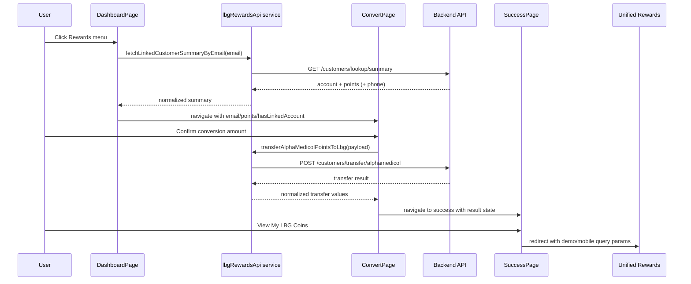

# AlphaMedicol Frontend Flow Guide

This document explains the end-to-end flow of the AlphaMedicol frontend so a teammate can understand the architecture quickly and build a similar app.

## 1) What This App Is

AlphaMedicol is a React + TypeScript + Vite application styled with Material UI.
It renders inside a mobile-device shell and includes:

- Authentication shell and login form
- Main dashboard
- Rewards conversion journey (AlphaMedicol Points -> LBG Coins)
- Success and redirection flow to Unified Rewards

## 2) High-Level Runtime Flow

```mermaid
flowchart TD
  A[main.tsx] --> B[ThemeProvider + CssBaseline + BrowserRouter]
  B --> C[App.tsx mobile shell]
  C --> D[AppRoutes.tsx]
  D --> E[/ -> RootEntryRoute -> /dashboard]
  D --> F[/login]
  D --> G[/forgot-password]
  D --> H[/signup]
  D --> I[/dashboard]
  D --> J[/lbg-rewards/convert]
  D --> K[/lbg-rewards/success]
```

## 3) Routing and Navigation Flow

### Route map

- `/` -> redirects to `/dashboard` through `RootEntryRoute`
- `/login` -> `LoginPage`
- `/forgot-password` -> `ForgotPasswordPage`
- `/signup` -> `SignUpPage`
- `/dashboard` -> `DashboardPage`
- `/lbg-rewards/convert` -> `LbgRewardsConvertPage`
- `/lbg-rewards/success` -> `LbgRewardsSuccessPage`
- Any unknown route -> redirects back to `/`

### RootEntryRoute behavior

`RootEntryRoute` reads query params and forwards identity to dashboard route state:

- `customerName` -> route state `userName`
- `customerEmail` -> route state `email`

This allows deep-linking into the app from external systems.

## 4) End-to-End User Journeys

### Journey A: Login to Dashboard

1. User opens `/login`.
2. `LoginPage` renders `AuthScreenLayout` + `LoginForm`.
3. `LoginForm` validates email/password using `react-hook-form`.
4. On submit, it derives user name from email prefix and navigates to `/dashboard` with route state.

### Journey B: Dashboard to Rewards Convert

1. `DashboardPage` resolves user identity from:
   - route state
   - query params
   - localStorage fallback
2. It stores `am_customer_name` and `am_customer_email` in localStorage.
3. User opens side menu and clicks `Rewards`.
4. Page calls `fetchLinkedCustomerSummaryByEmail(email)`.
5. If backend returns a linked customer, page gets live available points.
6. If phone exists, it stores normalized 10-digit phone as `am_customer_phone`.
7. Navigates to `/lbg-rewards/convert` with state:
   - `email`
   - `points`
   - `hasLinkedAccount`

### Journey C: Convert Points to LBG Coins

1. `LbgRewardsConvertPage` loads points from route state.
2. User taps "Convert to LBG Reward Points" card.
3. Modal opens with slider (`1..availablePoints`) and rate `1 point = 1 coin`.
4. On Confirm:
   - calls `transferAlphaMedicolPointsToLbg(...)`
   - sends email, points, optional idempotency key
5. On success:
   - closes modal
   - shows transfer backdrop animation
   - after ~7s navigates to `/lbg-rewards/success` with transfer results
6. On failure:
   - shows backend detail when present
   - else shows fallback error message

### Journey D: Success Page to Unified Rewards

1. `LbgRewardsSuccessPage` displays transfer summary.
2. User taps "View My LBG Coins".
3. Confirmation dialog opens.
4. On continue:
   - builds URL from `VITE_UNIFIED_REWARDS_URL` (fallback `http://localhost:5173/`)
   - appends `demo=1`
   - appends `mobile=<10 digit phone>` if available in localStorage
5. Browser redirects with `window.location.assign(...)`.

## 5) Page-by-Page Breakdown

## LoginPage

- Composes auth UI only.
- Delegates all logic to `LoginForm` and visual shell to `AuthScreenLayout`.

## ForgotPasswordPage

- Placeholder page using `AuthScreenLayout`.
- Contains back link to login route.

## SignUpPage

- Placeholder page using `AuthScreenLayout`.
- Contains back link to login route.

## DashboardPage

Responsibilities:

- Resolve and persist user identity
- Show main health-services dashboard UI
- Open left drawer menu
- Trigger rewards lookup flow and route to conversion page

Important behavior:

- Uses `fetchLinkedCustomerSummaryByEmail` to avoid stale hardcoded points.
- Avoids assuming points when API call fails.

## LbgRewardsConvertPage

Responsibilities:

- Present available points
- Validate conversion eligibility (`hasLinkedAccount` and points > 0)
- Let user choose conversion amount
- Call transfer API and handle loading/error/success states
- Route to success page

Internal helper components:

- `EarnCard`
- `ActivityRow`
- `BottomTab`

## LbgRewardsSuccessPage

Responsibilities:

- Display transfer completed confirmation
- Show converted and remaining balances
- Confirm redirect to external Unified Rewards app

## 6) Components Breakdown

## AuthScreenLayout

- Reusable page shell for auth pages
- Inputs: `title`, `subtitle`, `children`
- Adds brand header and footer text

## LoginForm

- Form handling via `react-hook-form`
- Validates email format and password min length
- Navigates to dashboard on submit
- Uses `SocialLoginButtons`

## SocialLoginButtons

- Visual-only Google/Apple buttons
- No OAuth logic wired yet

## 7) Service Layer and API Contracts

File: `src/services/lbgRewardsApi.ts`

Base URL:

- `API_BASE_URL = VITE_LBG_API_BASE_URL || http://localhost:8000`

Functions:

1. `checkLbgUnifiedAccountByEmail(email)`
- GET `/api/v1/customers/lookup/summary`
- Returns `true` if customer id exists
- Returns `false` on 404

2. `fetchLinkedCustomerSummaryByEmail(email)`
- GET `/api/v1/customers/lookup/summary`
- Returns:
  - `hasAccount`
  - `alphamedicolPoints`
  - `totalLbgPoints`
  - `phone`
- Returns zeroed values on 404

3. `transferAlphaMedicolPointsToLbg({ customerEmail, pointsToTransfer, idempotencyKey })`
- POST `/api/v1/customers/transfer/alphamedicol`
- Sends snake_case request fields expected by backend
- Returns normalized numeric transfer summary + blockchain tx hash

Utility:

- `toNumber(...)` safely converts `string | number | undefined` to number.

## 8) Imports and Exports Map

This section is a file-level map of what each module imports and exports.

| File | Main Imports | Export |
|---|---|---|
| `src/main.tsx` | React root, Router, MUI ThemeProvider/CssBaseline, `App` | none (entry file) |
| `src/App.tsx` | `AppRoutes`, `App.css` | `default App` |
| `src/routes/AppRoutes.tsx` | React Router APIs + page modules | `default AppRoutes` |
| `src/pages/LoginPage.tsx` | `LoginForm`, `AuthScreenLayout` | `default LoginPage` |
| `src/pages/ForgotPasswordPage.tsx` | MUI + RouterLink + `AuthScreenLayout` | `default ForgotPasswordPage` |
| `src/pages/SignUpPage.tsx` | MUI + RouterLink + `AuthScreenLayout` | `default SignUpPage` |
| `src/pages/DashboardPage.tsx` | MUI, icons, router hooks, service `fetchLinkedCustomerSummaryByEmail`, image assets | `default DashboardPage` |
| `src/pages/LbgRewardsConvertPage.tsx` | MUI, icons, axios (error typing), router hooks, service `transferAlphaMedicolPointsToLbg`, image assets | `default LbgRewardsConvertPage` |
| `src/pages/LbgRewardsSuccessPage.tsx` | MUI, icons, router hooks, image assets | `default LbgRewardsSuccessPage` |
| `src/components/layout/AuthScreenLayout.tsx` | MUI, `PropsWithChildren`, logo asset | `default AuthScreenLayout` |
| `src/components/auth/LoginForm.tsx` | MUI, `react-hook-form`, router hooks/link, `SocialLoginButtons` | `default LoginForm` |
| `src/components/auth/SocialLoginButtons.tsx` | MUI + icon imports | `default SocialLoginButtons` |
| `src/services/lbgRewardsApi.ts` | `axios` | named exports: `checkLbgUnifiedAccountByEmail`, `fetchLinkedCustomerSummaryByEmail`, `transferAlphaMedicolPointsToLbg` |

## 9) State/Data Passed Between Pages

## Route state models

### Dashboard input state

- `email?: string`
- `userName?: string`

### Rewards conversion input state

- `email?: string`
- `points?: number`
- `remainingPoints?: number`
- `userName?: string`
- `hasLinkedAccount?: boolean`

### Success page input state

- `email?: string`
- `originalPoints?: number`
- `remainingPoints?: number`
- `lbgPoints?: number`
- `updatedLbgPoints?: number`

## LocalStorage keys

- `am_customer_name`
- `am_customer_email`
- `am_customer_phone`

## 10) Styling/UX Architecture

- Global styles and animations in `src/index.css`.
- Mobile phone chrome and shell in `src/App.css`.
- Most screen-specific styling is in each TSX via MUI `sx` props.
- Theme is defined once in `src/main.tsx` and propagated via `ThemeProvider`.

## 11) Environment Variables Used

- `VITE_LBG_API_BASE_URL`: backend API base URL for customer lookup/transfer
- `VITE_UNIFIED_REWARDS_URL`: external Unified Rewards app URL for success redirect

## 12) How to Build a Similar App (Practical Blueprint)

1. Keep one router file (`AppRoutes`) as the source of truth for navigation.
2. Use page-level route state types for each journey, not generic `any`.
3. Keep API logic in services and return normalized UI-friendly objects.
4. Persist only minimal identity data in localStorage.
5. Add explicit UI states for async flows: idle, submitting, transferring, success, error.
6. Use reusable layout wrappers (`AuthScreenLayout`) for consistency.
7. Use a single conversion function with idempotency key support for safe retries.
8. Validate all route prerequisites before actions (email present, account linked, points > 0).
9. Use confirmation modals before external redirects.
10. Keep visuals in `sx` while preserving data logic in functions/hooks.

## 13) Quick Sequence for Rewards Transfer



## 14) Notes for Teammates

- Placeholder pages (`ForgotPasswordPage`, `SignUpPage`) are intentionally scaffold screens.
- Social login buttons are currently UI-only.
- Reward conversion is live API-driven; account linkage and points are not hardcoded in the conversion call.
- Success page defaults (125/0) are fallback display values if state is incomplete.
