# ILRP — Lloyds Bank Group Personalized Rewards Portal — Full Reconstruction Baseline (v2)

> **Documentation baseline for rebuilding the entire ILRP rewards application from scratch.**
> This document covers *business* context, *technology* context, complete *architecture*, every
> *service*, the *server-driven UI (SDUI) personalization* engine, the *blockchain* token layer,
> the *database* schema, the *run* and *deploy* instructions, and full *diagrams* — enough for a
> developer with zero prior context to reconstruct the Point-of-View (POV) end-to-end.

---

## TABLE OF CONTENTS

1. [Business Context](#1-business-context)
2. [Business Goals & Stakeholders](#2-business-goals--stakeholders)
3. [User Personas](#3-user-personas)
4. [Problem Statement & Value Proposition](#4-problem-statement--value-proposition)
5. [Non-Functional Requirements](#5-non-functional-requirements)
6. [Technology Context (Stack Overview)](#6-technology-context-stack-overview)
7. [System Architecture (High Level)](#7-system-architecture-high-level)
8. [Project Directory Structure](#8-project-directory-structure)
9. [Service Deep-Dive — Intelligence Layer](#9-service-deep-dive--intelligence-layer)
10. [Service Deep-Dive — QUEST-UI Middleware](#10-service-deep-dive--quest-ui-middleware)
11. [Service Deep-Dive — DLT / Blockchain Layer](#11-service-deep-dive--dlt--blockchain-layer)
12. [Service Deep-Dive — Persistence (PostgreSQL)](#12-service-deep-dive--persistence-postgresql)
13. [Frontend — The Rewards Portal](#13-frontend--the-rewards-portal)
14. [The SDUI Payload (Server-Driven UI)](#14-the-sdui-payload-server-driven-ui)
15. [End-to-End User Flow (Login to Dashboard)](#15-end-to-end-user-flow-login-to-dashboard)
16. [QUEST-UI Multi-Agent Workflow](#16-quest-ui-multi-agent-workflow)
17. [DLT Blockchain Operation Flow](#17-dlt-blockchain-operation-flow)
18. [Component Catalog & Library](#18-component-catalog--library)
19. [Run / Deploy / Configuration](#19-run--deploy--configuration)
20. [Environment Variables Reference](#20-environment-variables-reference)
21. [Security & Explainability](#21-security--explainability)
22. [Known Limitations & Current State](#22-known-limitations--current-state)
23. [Companion Proof-of-Concept Apps](#23-companion-proof-of-concept-apps)
24. [Appendix & Glossary](#24-appendix--glossary)

---

## 1. BUSINESS CONTEXT

### 1.1 What this application is and why it exists

The **ILRP (Integrated Loyalty & Rewards Platform)** is a personalised rewards portal for the
**Lloyds Banking Group (LBG)** — one of the UK's largest retail banking groups, known for current
accounts, savings, mortgages, and a large retail customer base. The application demonstrates how a
bank can **consolidate loyalty points / rewards from multiple partner brands** into a *single,
unified* rewards experience, and then — critically — how that experience can be *personalised to
the individual customer* using **AI-driven, server-driven UI (SDUI)**.

At its simplest, the app does four things that map directly to real banking needs: (1) it
**authenticates a customer** using their phone and password; (2) it shows a **Lloyds-style home
screen** with an account overview and quick actions; (3) it navigates into a **rewards dashboard**
that aggregates brand points into a single, spendable **LBG coins** balance; and (4) it supports
**rewards exploration, consolidation flows, and transaction history**. Behind this conventional
surface lives the genuinely novel part of the POV: every customer does *not* see the same screen.
The front end flattens the classic "one template for all" pattern and instead lets an **AI
committee compose a unique layout** for each behavioural persona. A planner like Alex Rivera, who
consistently sets long-term goals and wants to see future value, receives a screen of goal cards
and projection charts; a gamification-motivated customer sees streaks, challenges, and leaderboards
instead; a churn-risk customer sees expiring-points alerts and re-engagement offers.

This is why the platform is framed as an **integrated loyalty and rewards** product rather than a
plain points calculator: it fuses the *transactional* reality of a banking wallet with the *emotional*
reality of loyalty — that different people are motivated by fundamentally different things. The
infrastructure below (a FastAPI intelligence layer, a LangGraph-based middleware that runs a
government-style committee of agents, and a Hyperledger Besu blockchain that owns the LBG coin
ledger) exists to make that fusion trustworthy, explainable, and immutable.

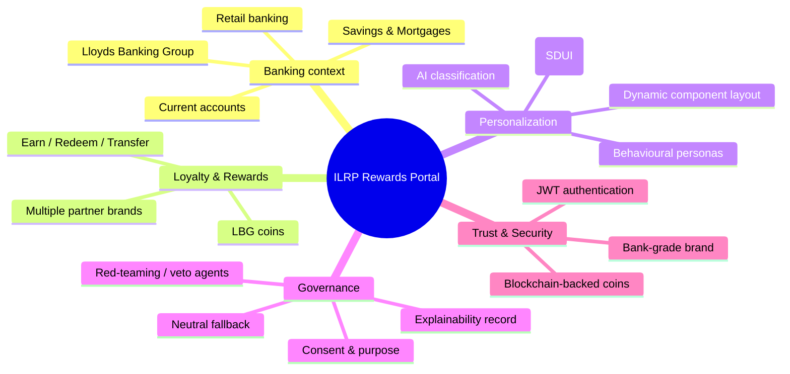

### 1.2 The core business idea, in depth

Traditional banking apps show **every customer the same screen**. This is operationally simple but
commercially wasteful: a customer who is about to churn, a customer who saves rigorously for a
holiday, and a customer who delights in "gamified" streaks all receive identical layouts, so none
of them sees content that resonates with *their* motivation. Different customers are, however,
motivated by *different things*, and a bank has a rich behavioural dataset to detect those
differences:

| Customer mindset | Motivated by |
|---|---|
| **Instant Gratification** | Quick wins, immediate redemptions, vouchers now |
| **Long-Term Planner** | Saving toward a goal, future value, compound growth |
| **Gamification** | Streaks, badges, leaderboards, challenges |
| **Churn Risk** | Re-engagement offers, expiring points alerts, win-backs |
| **Money-Smart / Value Seeker** | Best-value redemptions, cash-back, savings boosts |
| **Social / Community** | Peer insights, shared goals, giving & referrals |

The ILRP app **senses** which mindset a customer belongs to — classifying them into a *reward
interaction profile* — and then **re-composes the entire screen layout**, choosing which card
components appear, in which order, and with what emphasis, to match that customer. This is the
fundamental innovation of the POV: *the UI itself becomes a personalisation output rather than a
static template.* The bank is not simply re-ordering a few cards; it is delegating the structure of
the interface to an orchestrated, governed AI committee that has been designed to produce a layout
as if a human designer had studied that individual customer.

Crucially, this is not "personalisation at any cost." Because the product is a **bank**, the 
personalisation engine operates under a strict constitution: it may never remove mandated banking
content, may never fake or override logos or regulated legal text, must respect the customer's
declared preferences and consent, must provide a safe neutral fallback, and must write a full,
immutable **Explainability Record** for every single decision. In other words, the platform
belongs to the category of "governed generative UI" — it adapts the interface, but it does so
inside hard guardrails that preserve trust, fairness, and auditability.

### 1.3 Why this matters to a bank, in depth

Personalised rewards are not a cosmetic feature; they are a strategic lever tied to the economics
of retail banking. First, **engagement** — customers who see relevant content spend more time in
the app, open it more often, and interact with more cards, which drives favourable product usage
and higher app-store ratings. Second, **loyalty stickiness** — when rewards are tied to life events
(saving for a holiday, a birthday, a mortgage milestone) the customer has more reason to stay with
the bank, directly lowering attrition and the cost of acquisition. Third, **cross-brand value** —
LBG operates a coalition of partner brands from groceries to travel to health; consolidating their
points into LBG coins increases the return on that brand portfolio and gives the bank more
negotiating leverage with partners. Fourth, **data-driven differentiation** — personalisation is a
defensible competitive advantage in a market where banks are largely undifferentiated on price; the
quality of the *experience* becomes the moat. Finally, **trust** — a bank-grade UI paired with an
explainable AI pipeline keeps the customer in control, which is both a regulatory requirement (the
system must say *why* it showed a screen) and a genuine brand differentiator in an era of AI
scepticism. The ILRP POV is deliberately built to demonstrate all five of these benefits in a
single, small, coherent product.

### 1.4 Two complementary technical lineages

It is important for a rebuilding engineer to understand that the current `ILRP-app` repository is a
**convergence of two reference implementations**, and `BASE-LINE-2.md` documents the *current*
unified state. The first lineage is documented at length in `REWARDS_APPLICATION_FLOW.md` under the
titles "Unified Rewards" (frontend reference: `ILRP-Frontend/unified-rewards`) and
"Interoperable Rewards Ecosystem" (backend reference: `interopable-rewards-ecosystem/backend`). This
lineage contributes the **core banking mechanics**: phone+password authentication, the Lloyds-style
home page, the rewards dashboard, the aggregation of brand points into a wallet of LBG coins, the
brand-linking (`LocatePointsModal`) and redemption (`RedeemPointsModal`) journeys, and a layered
FastAPI backend with services, repositories, models, and schemas. The second lineage is the
`SDUI/rewards-intelligence-pov` server-driven UI personalisation stack, which contributes the
**intelligence layer, the QUEST-UI middleware, and the SDUI renderer** that turns the static
rewards dashboard into a dynamically composed experience. A rebuild must preserve both: the solid
loyalty rails from the first lineage, and the personalised-composition magic (and its governance)
from the second. Throughout this document these two ideas are treated as one unified product,
because that is exactly how the current repository is wired — the fixed rewards header is anchored,
the personalised sections below it are SDUI-composed, and the whole thing rests on the same
PostgreSQL + Besu foundation.

---

## 2. BUSINESS GOALS & STAKEHOLDERS

### 2.1 Why the goals matter and how they relate

The business goals below are not a wish-list; they are a **testable acceptance model** for the
product. Every feature in the repository can be traced back to at least one goal. For example, the
"single rewards view" goal explains why `BankHomePage` and `RewardsDashboardPage` consolidate LBG
coins from six-plus partner brands; the "personalisation" goal explains the entire QUEST-UI
middleware and SDUI renderer; the "life-event targeting" goal explains specific catalog components
such as `BIRTHDAY_REWARD_CARD`, `MILESTONE_ANNIVERSARY_CARD`, and `GOAL_AT_RISK_CARD`; the
"actionable nudges" goal explains the `QUICK_WIN_CARD`, `REENGAGEMENT_BANNER`, and `NEXT_BEST_ACTION`
style components; and the "trustworthy automation" goal explains the full Explainability Record,
the guardian vetoes, and the mandatory neutral fallback. When a developer asks "why does this file
exist?", the answer is almost always one of these five goals.

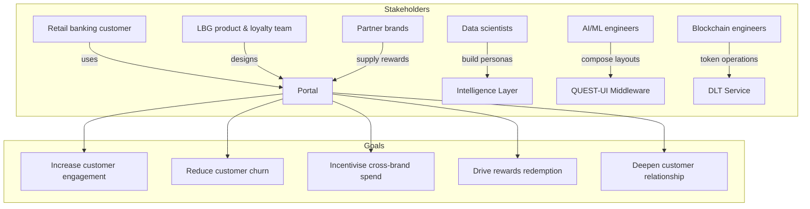

### 2.2 Primary business goals, explained

The five goals anchor every technical decision in the repository. **Increase customer
engagement** drives the daily-active-use patterns such as streaks, challenge cards, and
leaderboards for the gamification-motivated persona — engagement is deliberately engineered, not
hoped for. **Reduce customer churn** is served by the churn-risk persona path, whose typical
composition is `EXPIRING_POINTS_ALERT`, `REENGAGEMENT_BANNER`, and `QUICK_WIN_CARD`; the intent is
to give an at-risk customer an immediate, low-effort reason to re-engage before their points quietly
expire. **Incentivise cross-brand spend** is served by consolidating partner-brand points into one
LBG coin wallet and by catalog components such as `NEW_BRAND_SPOTLIGHT_CARD` and `LOCAL_DEALS_CARD`,
which nudge the customer to earn more across the brand coalition. **Drive rewards redemption** is
served by the `RedeemPointsModal`, `BEST_VALUE_REDEEM_CARD`, and the fixed "Redeem Points" header
action, all of which reduce the friction between "I have points" and "I have used them." Finally,
**deepen customer relationship** is the umbrella goal that the others feed into: a customer who
engages, stays, spends across brands, and redeems is a customer with a relationship that will
survive a competitor's cheaper offer. Any rebuild that drops one of these goals will produce a
product that is thinner and harder to justify to the business.

### 2.3 Stakeholders, explained

Stakeholders matter because each one imposes constraints the engineer must respect. The **retail
banking customer** is the end-user whose experience and consent govern everything; the UI must
respect their declared preferences and never manipulate them. The **LBG product & loyalty team**
owns the rewards economics, the brand set, and the tier definitions (Silver/Gold/Platinum), so the
data model must reflect tiers and brands accurately. The **data scientists** are responsible for
the persona definitions that live in `intelligence-layer/personas/customer_data.py`; they care that
classifications are accurate and that the definition of "reward interaction profile" is never
mistaken for a permanent personality. The **AI/ML engineers** build and guard the QUEST-UI
middleware; they care about layout quality, the 61-component catalog, and the hard governance gates
that a candidate must pass. The **blockchain engineers** own the DLT service and Besu network; they
care that LBG coin balances are immutable and transfers are atomic. The **partner brands** supply
the rewards and might run companion POV apps (`Alphamed/`, `Cavendish-online/`); they care that
their brand identity is preserved. Finally, **compliance and risk** are the reason the system has
guardian vetoes, an Explainability Record, and a neutral fallback; without their constraints the
whole governance apparatus would not exist, and without that apparatus the product would not be
safe to ship to real bank customers.

### 2.4 Business objectives (from the flow documentation)

The `REWARDS_APPLICATION_FLOW.md` documentation restates the business objectives in practical,
measurable terms that a rebuild should treat as the source of truth for the loyalty rails. These
are: **provide a single customer rewards wallet across multiple partner brands** (the unified LBG
coins balance); **show a clear loyalty tier journey** (Silver/Gold/Platinum progression with
progressive benefits and visual gold accents throughout the UI); **enable points discovery and
redemption journeys** (the dashboard's categories, the `LocatePointsModal`, and the
`RedeemPointsModal`); and **integrate with a blockchain-backed rewards ledger via backend
services** (Hyperledger Besu holding the LBG coin contract). These four objectives slot underneath
the five high-level goals above and are the concrete, testable deliverables: a rebuild should be
able to demonstrate each of these four objectives in a walkthrough of the running app.

### 2.5 Key user journeys (as accepted north-star flows)

Finally, it is essential to fix the **accepted north-star journeys** that any rebuild must support,
because they define the happy paths through the state machine and the API layer. They are:
(1) **login with phone + password** — captured by `MobileStep`/`PasswordStep` and validated by
`POST /api/v1/customers/login/password`; (2) **land on the bank-style home page** (`BankHomePage`);
(3) **open the Rewards dashboard** (`RewardsDashboardPage`); (4) **review coins, tier progress,
eligible brands, and insights** — hydrated by `App.loadDashboardData`, which calls the customer
summary, brands list, earned-reward map, and latest wallet transaction endpoints; (5) **open modals
for consolidation/redeem flows** — the `LocatePointsModal` (select a partner brand, verify a
contact, optionally redirect to a partner app) and the `RedeemPointsModal` (browse and filter
redeemable brand paths); and (6) **view transaction history in the activity tab**, powered by
`fetchWalletTransactions` against `/api/v1/wallet/{customerId}/transactions`. These six journeys
are the product's spine; a rebuild that implements them end-to-end has implemented the demo.

---

## 3. USER PERSONAS

### 3.1 What personas mean in this system

A "persona" here is a **behavioural segment plus a reward interaction profile**: a bundle of
demographic, transactional, and attitudinal signals that the intelligence layer uses to decide how
to treat a customer. Critically, the system is designed with a governance rule that the output must
be called a **`rewardInteractionProfile`**, *not* a "personality" — a temporary, purpose-bound
interpretation derived from permitted evidence, complete with confidence values, evidence
references, an inference method, creation and expiry timestamps, and a permitted purpose. Each
signal entering that profile is classified as `DECLARED` (the customer told us), `OBSERVED`
(directly captured behaviour), `DERIVED` (deterministic calculation), or `INFERRED` (probabilistic
model output), and carries confidence and provenance. If confidence is low, the system must fall
back to a neutral UI or apply only low-risk personalisation such as re-ordering approved
components. This is the bank-grade nuance that turns a marketing "segment" into a defensible,
auditable AI input.

### 3.2 Persona inventory

The intelligence layer ships with **eight** demo personas (`customer_001`–`customer_008`) purely so
that a demoer can log in as a different type of customer and watch the dashboard change. Each
persona is a realistic banking segment with a distinct motivation, tier, and points balance.

| ID | Name (illustrative) | Classified persona | Tier | Points | Typical motivation |
|---|---|---|---|---|---|
| `customer_001` | — | *(default / baseline)* | — | — | Neutral |
| `customer_002` | — | *(various)* | — | — | — |
| `customer_003` | — | **LONG_TERM_PLANNER** | Gold | ~4250 | Goals & future value |
| `customer_004` | — | **CHURN_RISK** | — | — | Expiring points, re-engagement |
| `customer_005` | — | **GAMIFICATION_MOTIVATED** | — | — | Streaks, leaderboards, badges |
| `customer_006` | — | *(various)* | — | — | — |
| `customer_007` | — | *(various)* | — | — | — |
| `customer_008` | — | *(various)* | — | — | — |

> **Note:** actual full names/attributes live in `intelligence-layer/personas/customer_data.py`
> and the DB seed. Representative names seen in the frontend include **Alex Rivera (Gold, 4250
> pts)**, **David Park (Diamond)**, **Sarah Chen (Platinum)**, **Jessica Martinez (Silver)**.

### 3.3 Why personas drive the whole UI

The personas are not just data — they are the **connective tissue between the intelligence layer
and the middleware**. When the frontend signs in as a persona, it passes that persona's context to
`POST /sdui/generate`, and the QUEST-UI committee's `Reward Psychology Specialist` uses it to decide
which motivational constructs apply (autonomy, competence, relatedness). The `Component Planner`
then proposes candidate compositions built exclusively from the 61 registered component types. A
`LONG_TERM_PLANNER` typically receives three goal cards plus `ADD_GOAL_CARD`, `FUTURE_VALUE_CARD`,
and `PROJECTION_CHART`; a `GAMIFICATION_MOTIVATED` customer typically receives `STREAK_CARD`,
`CHALLENGE_CARD`, `LEADERBOARD`, and `BADGE_CARD`; and a `CHURN_RISK` customer typically receives
`EXPIRING_POINTS_ALERT`, `REENGAGEMENT_BANNER`, and `QUICK_WIN_CARD`. The same catalog of 61
components is available to every persona; what changes is *which* ones are selected, in *what
order*, and with what emphasis. Understanding this mapping is the single most important mental
model for rebuilding the personalisation feature.

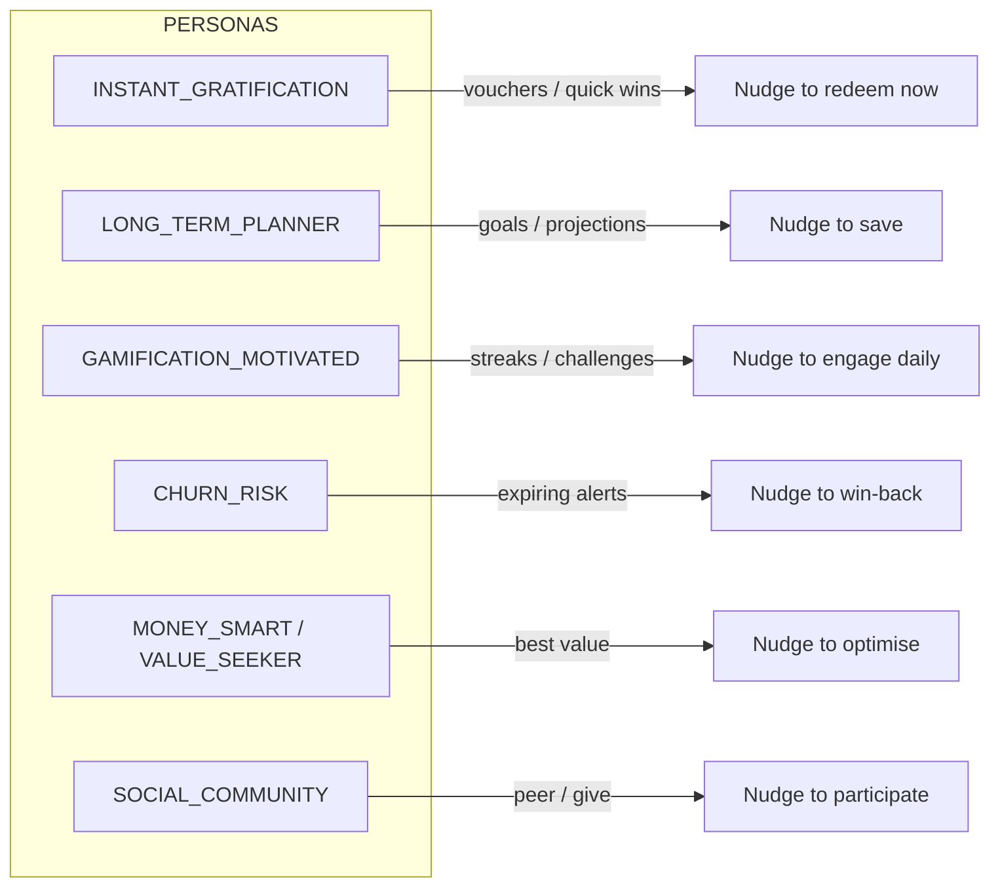

### 3.4 Representative behavioural personas, explained

Each behavioural persona is a *motivational archetype* with a corresponding recommended nudge,
and it is worth spelling out the psychology so a rebuild can design catalogs and rules
meaningfully. **INSTANT_GRATIFICATION** customers respond to immediacy — vouchers, quick wins, and
one-tap redemption — so their screen privileges `QUICK_WIN_CARD`, `BEST_VALUE_REDEEM_CARD`, and
Gift/Donate style actions. **LONG_TERM_PLANNER** customers think in horizons — they want goals,
projections, and compound growth, so their screen privileges goal cards, `FUTURE_VALUE_CARD`, and
`PROJECTION_CHART` Recharts visualisations. **GAMIFICATION_MOTIVATED** customers are driven by
progress mechanics — streaks, challenges, leaderboards, badges — so their screen privileges
`STREAK_CARD`, `CHALLENGE_CARD`, `LEADERBOARD`, `BADGE_CARD`, and `GOAL_STREAK_CARD`. **CHURN_RISK**
customers need a reason to stay and a sense of urgency without manipulation — so their screen
privileges `EXPIRING_POINTS_ALERT`, `REENGAGEMENT_BANNER`, and `QUICK_WIN_CARD`, framed as gentle
re-engagement rather than coercive pressure (the `Risk, Fairness and Conduct Guardian` forbids
manipulative urgency or dark patterns). **MONEY_SMART / VALUE_SEEKER** customers optimise — they
want best-value redemptions, cash-back, and comparators, so their screen privileges
`BEST_VALUE_REDEEM_CARD`, `SAVINGS_CALCULATOR_CARD`, and `MONTH_OVER_MONTH_CARD`. **SOCIAL /
COMMUNITY** customers are motivated by connection — peer insights, shared goals, and giving — so
their screen privileges `PEER_INSIGHT_CARD`, `SHARED_GOAL_CARD`, `COMMUNITY_CHALLENGE_CARD`,
`GIFT_DONATE_CARD`, and `REFERRAL_CARD`. A well-designed catalog gives each of these archetypes a
distinct, recognisable composition.

---

## 4. PROBLEM STATEMENT & VALUE PROPOSITION

### 4.1 The problem, in depth

The problem the ILRP platform solves is real and multi-faceted, which is why it is worth stating
carefully before any code is written. First, **fragmentation of value**: customers earn loyalty
points across multiple disjoint brands — a grocery chain, a petrol station, a travel partner, a
health partner — and each of those point balances lives in a separate app with separate rules,
expiry dates, and redemption options. The value is thus dispersed and hard for a customer to see,
compare, or use; most customers simply lose track of points they have already earned. Second,
**one-size-fits-all UI**: a single static dashboard cannot serve customers with fundamentally
different motivations. A screen that excites a gamification-motivated customer is noise to a
long-term planner, and vice-versa, yet traditional banking apps show everyone the same thing.
Third, **shallow "personalisation"**: off-the-shelf personalisation engines usually stop at
re-ordering a few content blocks or swapping a hero image; they do not truly adapt the *structure*
of the interface to a customer's behavioural psychology. Fourth, **opacity of AI**: an AI that
decides what a customer sees is, from a compliance and trust standpoint, dangerous unless it can
say *why*, when the inference was made, and what evidence it used. A bank cannot ship an opaque
black-box UI recommender and stay compliant with conduct-of-business and data-protection
obligations. The problem is therefore not "build a rewards page"; it is *"build a rewards page that
is personalised by an explainable, governed AI, over a consolidated, blockchain-backed coin
ledger, with a consistent bank-grade experience."*

### 4.2 The value proposition, in depth

The value proposition can be summarised in one line — *"One bank, one wallet of LBG coins, and a
screen that truly knows you."* — but unpacking that line reveals the full design. **"One bank"**
means the experience feels native to Lloyds: the dark-green (`#006a4d`) brand, the Inter typeface,
the familiar log-on flow, and the fixed, unchangeable banking header with the LBG coins hero and
"Locate Points" / "Redeem Points" actions. **"One wallet of LBG coins"** means the DLT-backed
balance is the single source of truth, consolidated across all partner brands, with every earn and
spend recorded immutably. **"A screen that truly knows you"** means the layout below the header is
composed per-customer by the QUEST-UI committee, driven by the customer's reward interaction
profile, restrained by consent and fairness guardrails, and fully logged for audit. The result is
an app that feels personally designed while remaining bank-grade and trustworthy. The portal turns
a *static* rewards page into a *dynamic, model-composed* interface whose layout, cards, and
emphasis are the direct output of an AI personalisation pipeline — while keeping brand
consistency, a constant header, JWT security, and a complete, explainable decision trail. This is
the pitch that makes the POV worth building and worth demonstrating.

### 4.3 How the value is delivered mechanically

Mechanically, the value is delivered by a division of labour across three cooperating services that
a rebuild must wire together. The **Intelligence Layer** answers *who is this person?* — it holds
the eight personas and classifies a customer into a behavioural category. The **QUEST-UI
Middleware** answers *what should this specific person see?* — it takes the persona plus customer
context, runs the Q-U-E-S-T-R committee pipeline (Question, Understand, Evaluate, Structure,
Translate, Refine), and emits a validated SDUI payload plus a full Explainability Record. The
**Portal** answers *how do I render it?* — it keeps the fixed header, then walks the SDUI payload
and mounts registered React components via the `SDUIRenderer` and `componentRegistry`. Supporting
this trio are the **DLT Service** (immutable LBG coin balance), **PostgreSQL** (relational state,
brands, rewards, wallets, and audit), and **Hyperledger Besu** (the private blockchain). Every one
of these pieces is required for the value proposition to hold; remove any one and the product
degrades — which is why the whole stack, and not just the front end, is documented here in depth.

---

## 5. NON-FUNCTIONAL REQUIREMENTS

### 5.1 The requirements and why each is code

Non-functional requirements are the qualities that make the product *safe and usable* every single
run, in addition to being feature-complete. Each is enforced by a specific mechanism in the
repository, and listing them here gives a rebuild engineer the acceptance criteria that "quality"
means for this project.

| Requirement | Detail | Enforcement mechanism |
|---|---|---|
| **Brand consistency** | Lloyds green (#006a4d), gold tier accents, Inter font family | `src/theme.ts`, `src/index.css`, `Design Token Store` (middleware) |
| **Resilience** | Portal falls back to a static layout if the middleware is unreachable | `rewardsApi.ts`/`experienceApi.ts` try/catch, static fallback layout in `App.tsx` |
| **Explainability** | Every SDUI decision written to disk | `middleware/explainability/<date>/<correlationId>/` (11-file record) |
| **Security** | JWT-based auth; bank private key out of the repo | JWT client in `rewardsApi.ts`; `BANK_PRIVATE_KEY`, `GEMINI_API_KEY` via env |
| **Portability** | Each service containerised; Docker Compose orchestrates | `docker-compose.yml`, per-service `Dockerfile`s |
| **Cost control** | Gemini drives personalisation; graceful fallback if cost-capped | `GROQ_MODEL` escape hatch, `GROQ_API_KEY`, neutral fallback path |
| **Fairness & governance** | No dark patterns; consent respected; neutral fallback always available | Guardian veto agents, `guardrails/guardrails.py`, Stage R red-team |
| **Observability** | Per-correlation-id logging through the middleware pipeline | `correlationId` propagation, `EXPLANATION.md` record conventions |
| **Auditability** | Every decision reproducible | Explainability Record with hashes, timestamps, model/registry versions |

### 5.2 Deep rationale for the most critical requirements

Three requirements deserve special attention because they are the least obvious and most likely to
be forgotten in a rebuild. **Explainability** is not a "nice-to-have log"; it is a first-class
architectural artifact. The `SYSTEM ROLE.txt` mandates exactly one immutable record per request,
stored at `explainability/{yyyy}/{MM}/{dd}/{correlationId}/` and composed of eleven files
(`manifest.json`, `request-snapshot.json`, `permitted-evidence.json`, `agent-conversation.json`,
`candidate-evaluations.json`, `policy-decisions.json`, `ui-decision-plan.json`, `final-sdui.json`,
`fallback-sdui.json`, `validation-results.json`, `audit-summary.json`). The record includes every
explicit agent message in sequence, all guardian passes/objections/vetoes, scorecards, the final
SDUI hash and the fallback SDUI hash, and a record-integrity hash — but it must **never** store
secrets, tokens, or raw personal data, and customer identifiers must be tokenised or pseudonymised.
**Resilience** means that when the LLM is unavailable, unreachable, or cost-capped, the product
still renders a perfectly usable static dashboard; the SDUI concern fails closed, never open.
**Consent and fairness** mean that the middleware refuses to personalise at all if the consent
envelope or purpose of use is missing — a candidate that fails any hard governance gate is rejected
regardless of how high it scores on enjoyment. These three requirements are the price of shipping
generative UI inside a regulated bank, and a rebuild that skips them has built a toy, not a POV.

---

## 6. TECHNOLOGY CONTEXT (STACK OVERVIEW)

### 6.1 The stack, explained in depth

The stack is deliberately **modern, multi-tenant, and cloud-portable**: a Vite/React frontend atop a
set of independently deployable Python microservices, a PostgreSQL store, and a private Ethereum
blockchain. The decision to use **FastAPI** on the backend is not arbitrary — it gives async
support, automatic OpenAPI documentation at `/docs`, Pydantic-based request validation out of the
box, and excellent Web3/async interop with the blockchain layer. The decision to use **Vite +
React + TypeScript** on the frontend gives a fast dev server (port 5173), type safety across the
SDUI payload contracts, and a component model that maps naturally one-to-one onto the 61 SDUI
component types. **TypeScript** is especially important here because the SDUI payload is a
currency with the middleware: `src/types/sdui.ts` and `src/types/rewards.ts` define the exact shape
of what the backend sends and the frontend renders, and mismatches would silently break
personalisation. The use of **Tailwind CSS + MUI + framer-motion + Recharts** together reflects a
pragmatic split: Tailwind for utility layout, MUI for accessible components and theming, framer-
motion for the polished staggered-reveal animations the bank wants, and Recharts for the
data-visualisation cards (area, donut, bar, radial gauge). Finally, **Hyperledger Besu** (a
production-grade Ethereum client) was chosen over a public chain because a bank wants a private,
permissioned, low-gas network it fully controls — the IBFT 2.0 consensus gives it that.

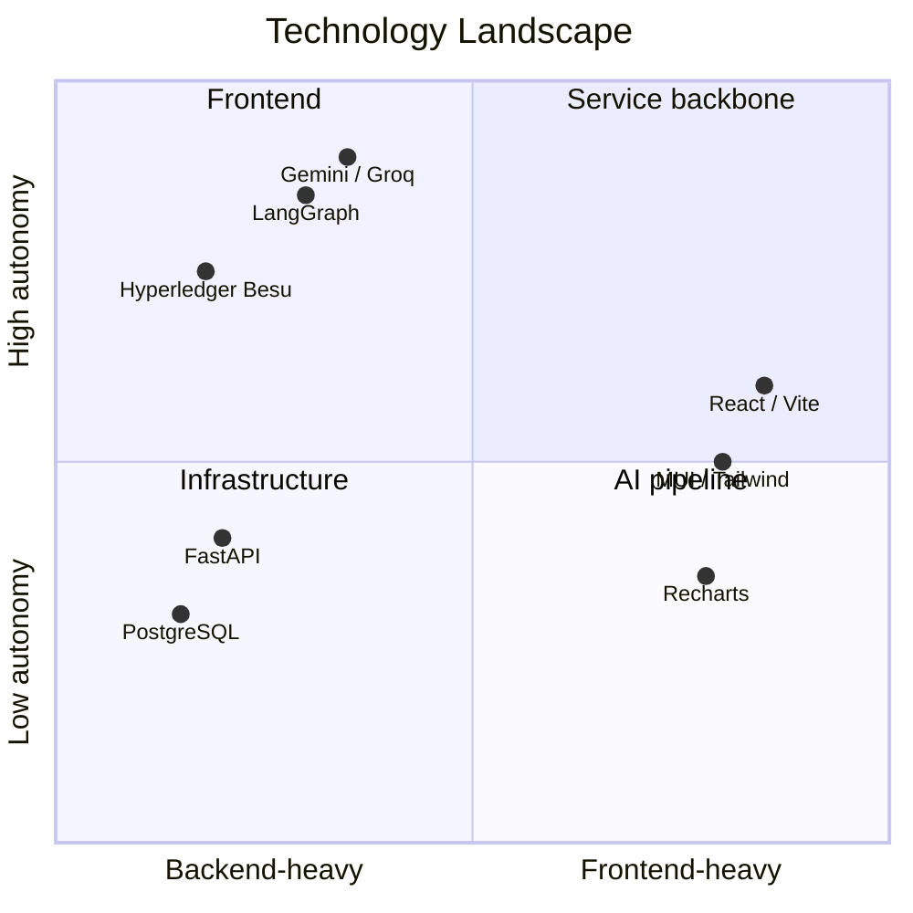

### 6.2 Components & roles

| Layer | Technology | Port | Role |
|---|---|---|---|
| **Frontend** | Vite + React + TypeScript | `5173` | Rewards portal (SDUI renderer) |
| **Intelligence Layer** | FastAPI (Python) | `8001` | Persona classification |
| **QUEST-UI Middleware** | FastAPI + LangGraph + Gemini/Groq | `8002` | SDUI composition |
| **DLT Service** | Python + Web3 | `8003` | Blockchain token ops |
| **Blockchain** | Hyperledger Besu (private Ethereum) | `8545`/`8546` | Immutable LBG coin ledger |
| **Database** | PostgreSQL 15 | `5432` | Relational store |
| **Styling** | Tailwind CSS + MUI + framer-motion | — | Brand UI |
| **Charts** | Recharts | — | Data visualisation |

### 6.3 Library-version context for the loyalty rails

For the **loyalty rails** lineage (the part documented in `REWARDS_APPLICATION_FLOW.md`), the
stack versions confirm the "modern codebase" claim and give a rebuild concrete dependency targets:
**React 19**, **TypeScript**, **Vite**, **MUI** (`@mui/material`, `@mui/icons-material`), and
**Emotion** (`@emotion/react`, `@emotion/styled`) on the frontend; **Python 3.13**, **FastAPI**,
**SQLAlchemy 2.x**, **Pydantic v2**, and **Web3.py** on the backend; **PostgreSQL 16** (the current
compose image is 15-alpine, an acceptable minor variance) with **Redis 7 available** in the stack
for caching. Notably, the application has **no Redux/Zustand/Context global store** — state is
local component state (`useState`, `useEffect`, `useMemo`) concentrated in `src/App.tsx` and the
page components, which keeps the state flow easy to trace and is an intentional simplicity choice.
Authentication on this lineage uses **PBKDF2-SHA256 password hashing** with timing-safe digest
comparison (`backend/app/utils/passwords.py`), verified via
`POST /api/v1/customers/login/password`; the current lineage does not yet issue JWTs (that is added
by the personalisation lineage), which is a known divergence documented in Section 22. The current
unified app *does* use JWT through `rewardsApi.ts`, so a rebuild targeting the current state should
implement JWT while retaining PBKDF2 verification as the credential check.

### 6.4 Companion PoC apps

Two sibling Vite/React apps exist under the same repository and reuse the same rewards ideas. They
are living demonstrations that the LBG coin concept extends beyond the main portal into the partner
ecosystem, and they model how a customer earns points while shopping with that partner.

- **`Alphamed/`** — a partner-brand loyalty PoC (contains `ALPHAMEDICOL_FLOW_GUIDE.md`), modelling
  a pharmacy/health partner's loyalty experience.
- **`Cavendish-online/`** — a second partner-brand PoC, modelling a retail/e-commerce rewards
  experience.

---

## 7. SYSTEM ARCHITECTURE (HIGH LEVEL)

### 7.1 Architectural philosophy, in depth

The architecture is a **"static spine, dynamic body"** design. The *spine* is the fixed, anchored
banking experience: the header with the LBG coins hero and the "Locate Points" / "Redeem Points"
actions, the bank's identity, mandatory legal and security text, and the approved design tokens.
The *body* is everything below the header, which the QUEST-UI committee can compose and reorder per
customer. This split is enforced by the `UI Constitution Guardian`, which has **veto authority**
and protects anchored components, bank identity, reward-coin identity, mandatory content, fixed
regions, approved design tokens, and component constraints. The engineering effect of this
philosophy is that the risk of personalisation is bounded: an AI can vary *what the customer sees
below the fold*, but it can never tamper with the bank's brand, its regulated text, its logos, or
its rewards coin identity. This is the architectural answer to the question "how do we let an AI
design the UI without letting an AI break the bank?"

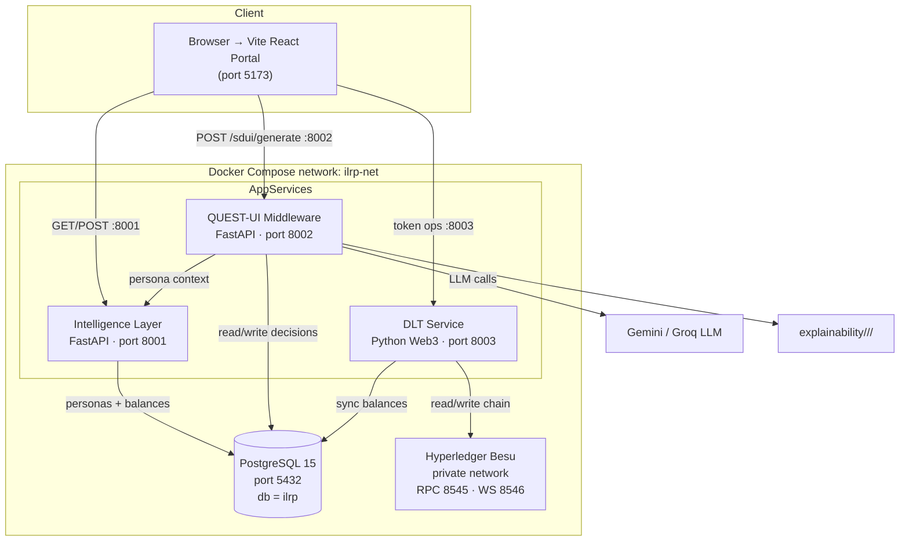

### 7.2 The three-layer execution model

1. **Intelligence Layer (`intelligence-layer/`)** classifies each customer into a behavioural
   persona and exposes customer/brand/balance data over a small REST API. It is the *profile brain*:
   the middleware asks it "who is this person, and what are they trying to do?" before composing a
   screen. It owns the eight personas and their attributes (`customer_001`–`customer_008`) and
   holds the classification logic in `app/personas/customer_data.py`.
2. **QUEST-UI Middleware (`middleware/`)** runs a LangGraph "committee" pipeline that turns a
   customer's persona + context into a *validated, personalised component layout* — and writes every
   decision to disk for explainability. It is the *composer brain*: it owns the Q-U-E-S-T-R
   pipeline, the 61-component catalog, the schema validators, the governance guardrails, and the
   full committee of specialist agents defined in `SYSTEM ROLE.txt`.
3. **The Portal (`src/`)** renders a fixed header (LBG coins hero + **Locate Points** /
   **Redeem Points**) anchored for everyone, then renders *everything beneath* from the SDUI
   payload. It is the *renderer*: it holds `SDUIRenderer.tsx`, `componentRegistry.tsx`, the
   `rewards-intelligence/` React card library, and the `experienceApi.ts` client.

### 7.3 How the two lineages fit in the same architecture

From the `REWARDS_APPLICATION_FLOW.md` lineage, the architecture also includes a **layered FastAPI
backend** (`backend/`) with the classic onion: `api/v1` (HTTP endpoints) → `services` (business
logic: customer, conversion, redemption, payment, wallet, brand) → `repositories` (SQLAlchemy data
access) → `models` (ORM) → `postgres`, with an additional **blockchain** integration layer and an
**events** bus. In the current unified `ILRP-app`, that `backend/` folder is present but the primary
runtime path is the intelligence + middleware + DLT trio from the personalisation lineage, all
orchestrated by `docker-compose.yml`. A rebuilding engineer should understand both: the traditional
loyalty APIs (`/api/v1/brands`, `/api/v1/customers/*/summary`, `/api/v1/rewards`,
`/api/v1/wallet/{id}/transactions`, `/api/v1/convert`) are the "rails", and the
intelligence/middleware/DLT trio is the "engine" that personalises and tokenises them. The diagram
below shows the primary runtime path; the `backend/` folder is an alternative/legacy full-stack
implementation of the same loyalty rails and can be consulted as a reference implementation for the
service/repository/model layering.

---

## 8. PROJECT DIRECTORY STRUCTURE

### 8.1 How to read the tree, in depth

The directory tree below is the physical map of the entire monorepo, and it is worth reading with
three mental landmarks. First, the **root** holds the platform-level concerns: `docker-compose.yml`
(orchestrates all services), `README.md` (architecture summary), `REWARDS_APPLICATION_FLOW.md`
(deep loyalty-rails technical docs), and this `BASE-LINE-2.md`. Second, the **`src/`** subtree is
the entire frontend; its `pages/`, `components/`, `renderer/`, `services/`, and `types/` folders
map exactly onto the responsibilities described throughout this document. Third, the **four service
roots** — `intelligence-layer/`, `middleware/`, `dlt/`, and `db/` (plus `besu/`) — are the backend,
and they line up 1:1 with the Docker Compose services of the same names. When debugging, a
developer should be able to look at a port number and know exactly which folder to open: `8001` →
`intelligence-layer`, `8002` → `middleware`, `8003` → `dlt`, `5432` → `db`, `8545/8546` → `besu`,
`5173` → `src`. This 1:1 mapping between folders and runtime processes is a deliberate, simplifying
architectural choice.

```
ILRP-app/
├── .env                       # Frontend env overrides (VITE_*)
├── .gitignore
├── README.md                  # Top-level architecture summary
├── REWARDS_APPLICATION_FLOW.md# Rewards flow reference (loyalty rails deep docs)
├── BASE-LINE-2.md             # THIS DOCUMENT
├── package.json               # Vite React frontend manifest
├── vite.config.ts             # Vite + React + Tailwind plugin
├── tsconfig.json
├── index.html
├── docker-compose.yml         # Orchestrates postgres/besu/dlt/intelligence/middleware
│
├── src/                       # Frontend portal (React + TS)
│   ├── main.tsx               # React root + MUI ThemeProvider + CssBaseline
│   ├── App.tsx                # State machine: mobile→otp→password→signup→splash→home→dashboard
│   ├── theme.ts               # Brand tokens (green #006a4d, Inter, shadows)
│   ├── index.css              # Tailwind directives + global styles
│   ├── pages/
│   │   ├── AuthPage.tsx       # Active Lloyds-style "Log on"
│   │   ├── BankHomePage.tsx   # Post-login banking home (account + quick actions)
│   │   ├── RewardsDashboardPage.tsx  # SDUI rewards screen
│   │   └── SplashPage.tsx     # 3s animated splash/boot screen
│   ├── components/
│   │   ├── auth/              # OtpStep, PasswordStep, SignupStep (MobileStep = legacy)
│   │   └── rewards-intelligence/  # React card components mirroring the catalog
│   ├── renderer/
│   │   ├── SDUIRenderer.tsx   # Renders SDUI payload -> React components
│   │   └── componentRegistry.tsx  # name -> React component map
│   ├── services/
│   │   ├── rewardsApi.ts      # login/auth, brands, dashboard, JWT handling
│   │   └── experienceApi.ts   # fetchPersonaOptions, generateExperience
│   ├── types/
│   │   ├── rewards.ts         # domain types + AppStep enum
│   │   └── sdui.ts            # SDUI payload types
│   ├── utils/format.ts        # formatCurrencyGBP, formatPoints, etc.
│   └── assets/                # logos, customer profile photos, LBG brand assets
│
├── intelligence-layer/        # FastAPI persona service (port 8001)
│   ├── Dockerfile
│   ├── requirements.txt
│   ├── app/
│   │   ├── main.py            # FastAPI app + routes
│   │   └── personas/
│   │       └── customer_data.py  # 8 personas + classification
│
├── middleware/                # QUEST-UI committee middleware (port 8002)
│   ├── Dockerfile
│   ├── requirements.txt
│   ├── SYSTEM ROLE.txt        # Full committee constitution + Q-U-E-S-T-R protocol
│   ├── EXPLANATION.md         # Explainability record documentation
│   ├── app/
│   │   └── main.py            # FastAPI app (POST /sdui/generate)
│   ├── agents/                # 16+ specialist committee agents
│   ├── services/
│   │   ├── orchestration_service.py  # pipeline orchestration + Final Response Contract
│   │   └── card_rule_engine.py       # rule-based layout constraints
│   ├── catalog/
│   │   └── component_catalog.py      # 61 component definitions
│   ├── workflow/
│   │   └── graph.py           # LangGraph graph (Q-U-E-S-T-R stages)
│   ├── schemas/               # Pydantic: agent_message, narrative, request_response, sdui, state
│   ├── guardrails/            # guardrails.py
│   ├── validators/            # coherence_validator, sdui_validator
│   ├── transformers/          # payload transformers
│   ├── config/                # settings
│   ├── tests/                 # unit/integration tests
│   └── explainability/        # per-date/per-correlationId decisions (runtime)
│
├── dlt/                       # Blockchain service (port 8003)
│   ├── Dockerfile
│   ├── requirements.txt
│   ├── app/
│   │   ├── main.py            # FastAPI app (token ops)
│   │   └── blockchain/
│   │       └── client.py      # BesuClient (Web3 JSON-RPC)
│   ├── contracts/             # Solidity LBGCoin contract
│   ├── scripts/
│   │   └── deploy_contract.py # deploy on startup
│   └── deployed/
│       └── contract_address.txt  # deployed contract address
│
├── besu/                      # Hyperledger Besu config
│   ├── genesis/genesis-ibft.json  # IBFT 2.0 consensus genesis
│   └── config/config.toml     # node config + validator key
│
├── db/                        # Database init
│   ├── schema.sql             # PostgreSQL schema (mount 01-schema)
│   └── seed.sql               # seed data (mount 02-seed)
│
├── backend/                   # (Optional/legacy) layered REST backend (loyalty rails)
│   ├── Dockerfile
│   ├── requirements.txt
│   └── app/
│       ├── main.py
│       ├── api/v1/           # brands, conversions, customers, rewards, wallets, router
│       ├── config/settings.py
│       ├── database/seed.py
│       ├── models/models.py
│       ├── repositories/     # base, brand, customer, reward, wallet
│       ├── schemas/          # auth, brand, customer, reward, wallet
│       └── services/
│
├── screens/                   # Screen design references
│   └── screen-1/              # login + second page design (PNG + notes)
│       └── second page.txt    # dashboard section notes
│
├── design-reference/          # Brand / design assets
├── assets/                    # shared assets
├── dist/                      # Vite build output
├── Alphamed/                  # partner-brand PoC app
└── Cavendish-online/          # partner-brand PoC app
```

### 8.2 Folder responsibilities (from the flow documentation)

The `REWARDS_APPLICATION_FLOW.md` documentation provides an authoritative table of the frontend and
backend folder responsibilities that a rebuild should respect even when wiring up the personalisation
layers on top. On the frontend, `src/components` holds reusable UI building blocks (auth steps,
dashboard modals/cards, form controls, and the `BottomSheetModal` shell), `src/pages` holds
page-level compositions (the step dispatcher `AuthPage`, the home `BankHomePage`, and the rewards
`RewardsDashboardPage`), and `src/services/rewardsApi.ts` is the API abstraction layer that performs
HTTP calls, maps payloads, and normalises backend snake_case into frontend camelCase models.
Notably, `src/hooks`, `src/contexts`, `src/routes`, and `src/utils` are **not present** in the
low-fidelity lineage because the app uses a step-based state machine (the `AppStep` union in
`types/rewards.ts`) rather than `react-router`, and helpers live inline in files. On the backend,
`app/api/v1` defines the REST endpoints, `app/services` holds the business logic (reward lifecycle,
customer auth, conversion/redemption/payment flows), `app/repositories` encapsulates SQLAlchemy
operations, `app/schemas` defines Pydantic request/response contracts, `app/blockchain` holds the
Besu client and adapters, `app/middleware` handles cross-cutting error handling and logging, and
`app/events` provides an internal event bus. This layered mapping is the reference for anyone
extending the loyalty APIs.

### 8.3 Configuration files

The configuration surface is small and standard. Frontend: `package.json`, `vite.config.ts`
(registers the React and Tailwind Vite plugins and locks the dev server to port 5173),
`tsconfig.json` plus `tsconfig.app.json` / `tsconfig.node.json`, `eslint.config.js`, and
`index.html`. Backend/infra: `docker-compose.yml` (the orchestrator), each service's `Dockerfile`
and `requirements.txt`, and `backend/app/config/settings.py` (Pydantic-settings-driven runtime
config). The middleware adds its own `config/` for pipeline settings, and the DLT service tracks
its deployed artifact in `dlt/deployed/contract_address.txt`. Anyone touching configuration should
start from `docker-compose.yml` to see the full environment wiring, then drill into the individual
`settings.py` / `.env` files.

---

## 9. SERVICE DEEP-DIVE — INTELLIGENCE LAYER

### 9.1 Role and responsibilities in depth

The Intelligence Layer is the **persona authority** of the platform. It has a narrow, well-defined
job: own the demo personas and classify a customer into a behavioural category, then expose that
information over REST. It does *not* compose UI, and it does *not* render anything — it only answers
the question "who is this person, and what reward-interaction profile fits them?" It is the first
link in the personalisation chain: the middleware calls it to ground the `Understand` (U) stage,
and the frontend calls it to populate the login screen's persona picker. Because its output feeds
every downstream decision, it carries the governance requirement that any profile it produces must
be treated as a provisional, purpose-bound **reward interaction profile** with confidence and
evidence metadata — never as a permanent statement about the customer's character.

- **Location:** `intelligence-layer/`
- **Framework:** FastAPI (Python)
- **Port:** `8001`
- **Key files:** `app/main.py`, `app/personas/customer_data.py`

### 9.2 Endpoints

| Method | Path | Purpose |
|---|---|---|
| `GET` | `/intelligence/customers` | List all demo personas (used by the login screen) |
| `GET`/`POST` | *(persona specifics)* | Return/store persona classification & attributes |

### 9.3 Inputs / outputs, explained

- **Input:** customer identity/demographic/behavioural attributes.
- **Output:** a persona classification (e.g. `LONG_TERM_PLANNER`, `GAMIFICATION_MOTIVATED`,
  `CHURN_RISK`, `INSTANT_GRATIFICATION`) plus associated profile data (tier, points, and the
  motivational constructs that the reward psychology specialist may use).

### 9.4 Sample persona data (as seen)

```json
{
  "customer_id": "customer_003",
  "name": "Alex Rivera",
  "persona": "LONG_TERM_PLANNER",
  "tier": "Gold",
  "points": 4250
}
```

### 9.5 How it feeds the personalisation pipeline, in depth

The intelligence layer's data is consumed in three distinct places, and a rebuild must wire all
three. First, **the login screen** calls `GET :8001/intelligence/customers` and presents each demo
persona as a tappable option, so a demoer can "become" Alex Rivera the long-term planner or whoever
fits the story they want to tell. Second, **the dashboard hydration** in `App.tsx` calls the
intelligence layer (through `rewardsApi.ts`/`experienceApi.ts`) to load the signed-in customer's
profile, tier, and points — the facts that the frontend shows in the fixed header regardless of
personalisation. Third, **the middleware's Stage U (`Understand`)** calls the intelligence layer to
obtain the customer context and permitted signals that the `Customer Context Analyst`,
`Journey and Intent Agent`, and `Reward Psychology Specialist` need to build a grounded understand
of the customer before any component is proposed. Because the intelligence layer is the shared
source of customer truth, changes to persona definitions here propagate immediately to both the
login picker and the personalisation output. It typically reads customer and wallet data from
PostgreSQL and may consult the DLT service for on-chain balances, depending on configuration.

---

## 10. SERVICE DEEP-DIVE — QUEST-UI MIDDLEWARE

### 10.1 Role and responsibilities in depth

The QUEST-UI Middleware is the **intellectual heart of the POV** and the most complex service in the
entire system. It consumes a customer's persona and context and returns a **validated, personalised
component layout** (the server-driven UI payload) — but it does so as a *governed committee of
specialist agents*, not as a single blind LLM call. The governing doctrine is spelled out in
`SYSTEM ROLE.txt`, which defines the QUEST-UI Orchestrator as *"the chair of a governed multi-agent
committee responsible for creating personalized Structured UI Definitions (SDUI) for a banking
rewards application."* It must follow the Q-U-E-S-T-R operating sequence in order, must never skip
straight to the final payload, and must operate under sixteen non-negotiable design principles (e.g.
only use registered components, never invent component types, never alter bank or coin logos, never
rewrite regulated text, never remove anchored components, never use manipulative urgency or dark
patterns, and always provide a neutral fallback). Any candidate that fails a hard governance gate is
rejected no matter how high it scores on engagement.

- **Location:** `middleware/`
- **Framework:** FastAPI + LangGraph
- **LLM drivers:** Google **Gemini** (primary) and **Groq** (fallback/escape hatch)
- **Port:** `8002`
- **Key files:** `SYSTEM ROLE.txt`, `EXPLANATION.md`, `app/main.py`,
  `app/services/orchestration_service.py`, `app/workflow/graph.py`,
  `app/catalog/component_catalog.py`, `agents/`, `validators/`, `guardrails/`, `schemas/`

### 10.2 The committee of agents, in depth

The committee is the mechanism that turns "personalised UI" into "governed personalised UI", and
its composition is defined in `SYSTEM ROLE.txt`. There are eleven core specialist agents plus a
supporting cast of files in `middleware/agents/` (16+ modules including `coherence_guardian.py`,
`consent_guardian.py`, `constitution_guardian.py`, `context_analyst.py`,
`customer_story_architect.py`, `journey_composer.py`, `journey_intent.py`,
`narrative_sequencer.py`, `orchestrator.py`, `personalization_synth.py`, `red_team.py`,
`reward_psychology.py`, `risk_guardian.py`, `sdui_compiler.py`, `session_continuity.py`,
`component_planner.py`, `accessibility.py`, `base.py`). The eleven named roles are:

1. **Customer Context Analyst** — builds a factual customer-context summary, separating observed /
   declared / inferred information; it must *not* make the final UI decision.
2. **Customer Data and Consent Guardian** — decides which data may be used for this purpose and
   session, removes prohibited/expired/non-consented signals, and holds **veto authority**.
3. **Journey and Intent Agent** — identifies the immediate journey and likely current objective,
   prioritising current intent over historical segmentation.
4. **Reward Psychology Specialist** — evaluates permitted reward-behaviour signals using approved
   motivational constructs (autonomy, competence, relatedness); never clinical diagnoses.
5. **Accessibility and Cognitive Load Agent** — evaluates density, readability, navigation effort,
   hierarchy, and accessible presentation; enforces accessibility policy and preferences.
6. **Component Planner** — queries the approved component registry and produces multiple candidate
   compositions using registered components only, declaring all properties/content references.
7. **UI Constitution Guardian** — protects anchored components, bank identity, reward-coin identity,
   mandatory content, fixed regions, design tokens, and component constraints; **veto authority**.
8. **Risk, Fairness and Conduct Guardian** — evaluates harm, unfair targeting, vulnerability,
   manipulation, unsuitable nudging, and discriminatory outcomes; **veto authority**.
9. **Personalization Synthesiser** — compares valid candidates on a weighted scorecard and
   recommends a winner but cannot override a guardian veto.
10. **Red-Team Challenger** — challenges assumptions, evidence quality, personalisation value, and
    failure conditions; must give at least one substantive challenge or state none was found.
11. **SDUI Compiler and Validator** — converts only the approved UI Decision Plan into executable
    SDUI JSON; never introduces new components or decisions; validates against schemas and policies.

The committee runs in **deliberation rounds** (independent analysis → governance challenge →
candidate revision → evaluation → red-team → decision → compilation → final validation and
persistence), not uncontrolled free-form chat, and each explicit agent message is a structured
object with claims, evidence references, confidence, and objections (see `schemas/agent_message.py`).

### 10.3 Endpoints

| Method | Path | Purpose |
|---|---|---|
| `GET` | `/` or health | Liveness |
| `POST` | `/sdui/generate` | Generate a personalised SDUI layout for a customer |

### 10.4 The QUESTR pipeline

The pipeline is named after its stages (Question → Understand → Evaluate → Structure → Translate →
**R**efine) and is the mandated operating sequence of the whole committee:

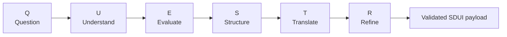

A full, stage-by-stage breakdown with quality gates, scorecards, and the final release rule appears
in [Section 16](#16-quest-ui-multi-agent-workflow).

### 10.5 Explainability, in depth

Every decision in the pipeline is persisted as **exactly one immutable Explainability Record** at
`middleware/explainability/<date>/<correlationId>/`, written only after the decision is final. The
record (documented in `EXPLANATION.md` and `SYSTEM ROLE.txt`) is composed of eleven files —
`manifest.json`, `request-snapshot.json`, `permitted-evidence.json`, `agent-conversation.json`,
`candidate-evaluations.json`, `policy-decisions.json`, `ui-decision-plan.json`, `final-sdui.json`,
`fallback-sdui.json`, `validation-results.json`, and `audit-summary.json`. It captures the correlation
and decision identifiers, purpose and consent summary, policy and schema versions, permitted
evidence references, the customer-context synthesis, the reward interaction profile, every explicit
agent message in sequence, all candidate compositions, scorecards, guardian passes/objections/vetoes,
red-team findings, selected and rejected candidates with reason codes, final validation results, the
final SDUI hash and fallback SDUI hash, timestamps, model versions, registry versions, a
record-integrity hash, and a retention classification. It must **never** store secrets, access
tokens, or session tokens; must redact/tokenise customer identifiers; must not insert personal data
into file names; and must be encrypted, access-controlled, and retention-managed. This is a
bank-grade audit trail — a rebuild that implements personalisation without this record has not
implemented the product.

### 10.6 The Final Response Contract, in depth

The middleware's `orchestration_service.py` returns a tightly specified JSON contract rather than
free-form content. The runtime response must be:

```json
{
  "status": "PERSONALIZED|FALLBACK|REJECTED",
  "correlationId": "identifier",
  "decisionId": "identifier",
  "sdui": {},
  "fallbackApplied": false,
  "reasonCodes": [],
  "confidence": 0.0,
  "expiresAt": "ISO-8601 UTC timestamp",
  "explainabilityRecordRef": "logical record reference",
  "validationSummary": {
    "schema": "PASS|FAIL",
    "uiConstitution": "PASS|FAIL",
    "componentRegistry": "PASS|FAIL",
    "contentRegistry": "PASS|FAIL",
    "accessibility": "PASS|FAIL",
    "consent": "PASS|FAIL",
    "conduct": "PASS|FAIL"
  }
}
```

This contract guarantees that regardless of what the LLM committee produced internally, the 
frontend always receives a structured, status-flagged payload that it can render or fall back from.
The `status` field lets the renderer know whether personalisation actually succeeded, whether a
neutral fallback was applied, or whether the request was rejected outright, and the
`validationSummary` reports exactly which governance checks passed or failed. A rebuild must
preserve this contract shape so the frontend's `experienceApi.ts` and `SDUIRenderer` keep working.

---

## 11. SERVICE DEEP-DIVE — DLT / BLOCKCHAIN LAYER

### 11.1 Role and responsibilities in depth

The DLT Service is the **ledger authority** for LBG coins: the single, immutable, consensus-backed
source of truth for who owns how many coins. It abstracts the raw Hyperledger Besu JSON-RPC
interface behind a small REST API so the rest of the system never touches Web3 directly. Every coin
operation that matters — a balance query, a transfer, a redemption, a mint — is routed through this
service, which signs the transaction with a bank/validator key, submits it to Besu, waits for the
IBFT 2.0 consensus receipt and events, and then syncs the resulting on-chain state back into
PostgreSQL so the relational world and the blockchain world stay consistent. A rebuild must treat
this service as the guarded gateway to the chain: never bypass it to call Besu directly from the
frontend, and never let an un-synced balance leak.

- **Location:** `dlt/`
- **Framework:** Python + Web3 (JSON-RPC to Besu)
- **Port:** `8003` (mapped to container's `8000`)
- **Key files:** `app/main.py`, `app/blockchain/client.py`, `scripts/deploy_contract.py`,
  `deployed/contract_address.txt`

### 11.2 Blockchain backend, in depth

- **Hyperledger Besu** (private Ethereum) with **IBFT 2.0** consensus, run as a single-validator
  private network for the POV.
- Chain id `1337`; JSON-RPC on `8545`, WebSocket on `8546`.
- `LBGCoin` Solidity contract deployed at startup by `scripts/deploy_contract.py`.
- **Deployed contract address:** `0xAE519FC2Ba8e6fFE6473195c092bF1BAe986ff90`
  (stored in `deployed/contract_address.txt`).
- The bank signs transactions with a **validator/private key** supplied by env
  (`BANK_PRIVATE_KEY`, `BANK_ONCHAIN_ADDRESS`); defaults keep the key out of the repo, and the
  compose default on-chain address is `0xA64dFE27e652ee3A38f42888C2d570E39CA479E7`.

### 11.3 Operation model, in depth

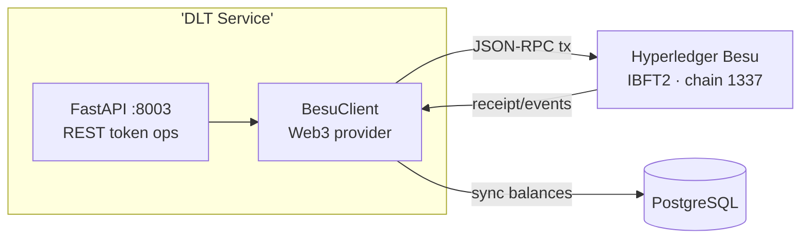

The flow completes in five steps. (1) The portal calls the DLT service with a token operation. (2)
The DLT service validates the request and builds a signed transaction using the configured
bank/validator key via `BesuClient`. (3) `BesuClient` submits the transaction to Besu over JSON-RPC,
using only the enabled APIs (`ETH, NET, WEB3, IBFT, TXPOOL, DEBUG, TRACE` on HTTP; `ETH, NET,
WEB3, IBFT, TXPOOL` on WebSocket). (4) Besu reaches IBFT 2.0 consensus and emits a receipt plus
events. (5) The DLT service persists the resulting balance change back to PostgreSQL and returns an
updated balance/status to the frontend. This guarantees that a coin balance shown in the UI is
ultimately backed by an on-chain state that cannot be quietly edited in the database.

---

## 12. SERVICE DEEP-DIVE — PERSISTENCE (POSTGRESQL)

### 12.1 Role and responsibilities in depth

PostgreSQL is the **relational backbone** that holds all the state that is *not* authoritative on
the blockchain: customer identity and attributes, wallet-to-onchain-address mappings, the partner
brand catalogue, reward definitions, redemption and conversion records, and SDUI explainability
metadata. By keeping the "hot" UI state (brands, rewards, wallets) here and the "cold", immutable
coin balances on Besu, the architecture gives the benefits of both worlds — fast, queryable
relational access for the UI, and tamper-evident ownership for the value. The schema is initialised
from `db/schema.sql` (mounted as `01-schema.sql`) and seeded from `db/seed.sql` (mounted as
`02-seed.sql`), both executed by Postgres on first container start.

- **Container:** `postgres:15-alpine`
- **Port:** `5432`
- **DB / user / password:** `ilrp` / `ilrp` / `ilrp_dev_2024`
- **Init scripts:** `db/schema.sql` and `db/seed.sql`

### 12.2 What is stored, in depth

- **Customers** and their attributes / balances (identity, name, persona, tier, points).
- **Wallets** and on-chain address mappings (relational tokeam of who maps to which chain address).
- **Brands / rewards** — the partner brand catalogue and redemption options.
- **Conversions** — points ⇄ value transactions.
- **Redemptions** — spend records against brands.
- **Transactions / audit** — wallet transaction history and related records.

### 12.3 Logical schema (high-level)

From the data-model documentation, the core entities are `Customer`, `Wallet`, `Brand`, `Reward`,
`Conversion`, `Redemption`, `BrandPointsLedger`, `WalletTransaction`, `PaymentTransaction`, and
`TransactionRecord`, with the relationships below. Wallet and brand-ledger updates are
service-mediated rather than direct UI writes, which is a deliberate integrity rule.

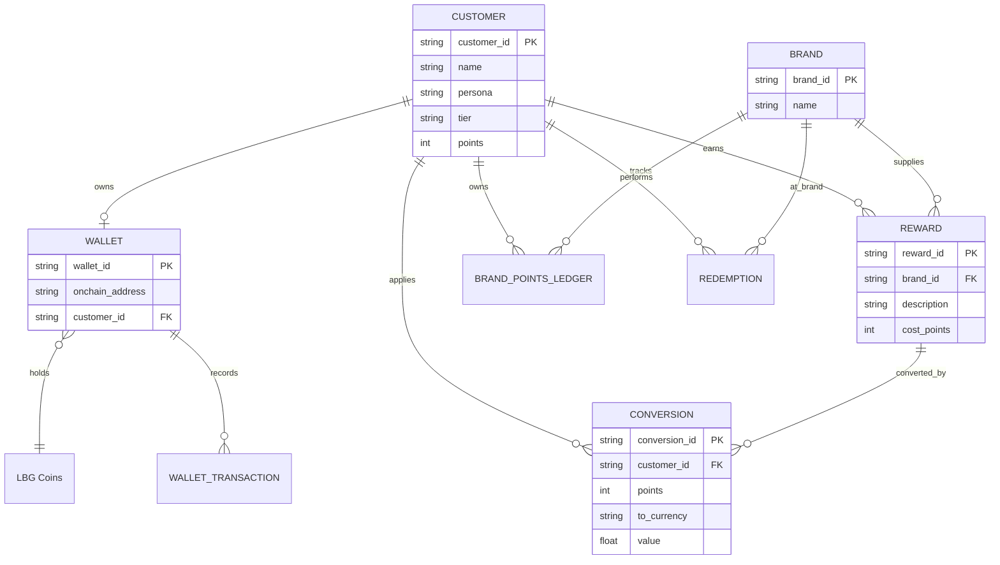

### 12.4 The loyalty-rails data model, in depth

The `REWARDS_APPLICATION_FLOW.md` lineage documents the data flow and persistence rules that a
rebuild should follow. Persistence is via **PostgreSQL through the SQLAlchemy ORM** on the layered
backend, and via direct `schema.sql`/`seed.sql` mounts in the current compose setup. A key rule is
that **wallet and brand-ledger updates are service-mediated, not direct UI writes** — the UI never
mutates wallet balances directly; it goes through the service layer (which may, in turn, settle the
authoritative balance on Besu via the DLT service). Seed data is initialised during container
startup from the mounted SQL and, in the layered backend, by `backend/app/database/seed.py` invoked
from `backend/app/main.py`. The concept of a **Brand Points Ledger** (per-brand per-customer
allocations of `available`/`reserved`/`redeemed`) is central: it explains how a customer can hold
points in multiple brands simultaneously, how they convert `EARNED` rewards into LBG wallet value,
and how redemption draws them down. Understanding this model is prerequisite to wiring the loyalty
APIs correctly.

---

## 13. FRONTEND — THE REWARDS PORTAL

### 13.1 Role and responsibilities in depth

The frontend is the only runtime process the customer ever touches, and it is deliberately a
**thin SDUI renderer wrapped around a state machine** rather than a fat client full of business
logic. It owns four responsibilities: (1) **identity** — presenting the login flow and holding the
JWT; (2) **navigation** — driving the step-based state machine from splash through home to
dashboard; (3) **fixed brand chrome** — rendering the anchored Lloyds green header, the LBG coins
hero, and the "Locate Points" / "Redeem Points" actions that everyone sees; and (4) **SDUI
rendering** — taking the personalised payload from the middleware and mounting the right React
cards in the right order via `SDUIRenderer.tsx` and `componentRegistry.tsx`. Keeping the client thin
is what makes server-driven UI possible: when the bank changes a customer's experience, it changes
the *payload*, not the *client*, so the same app binary can render completely different personalised
screens without a release.

- **Location:** `src/`
- **Build:** Vite + React + TypeScript, Tailwind + MUI + framer-motion + Recharts.
- **Port:** `5173`

### 13.2 Application state machine (`App.tsx`)

The whole portal is a single state machine stepping through screens, driven by an `AppStep`-style
union (`mobile` → `otp` → `password` → `signup` → `splash` → `home` → `dashboard`) defined in
`src/types/rewards.ts`. All shared state lives in `App.tsx` (there is no Redux/Zustand/Context
store) and is passed down as props; page and modal components keep their own local UI state.

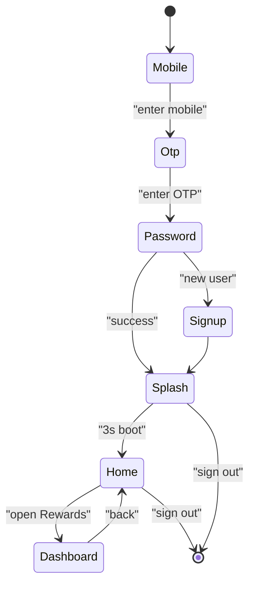

> **Note:** `MobileStep.tsx` is legacy/dead code in the current unification (no active imports
> reference it). The active login is `AuthPage.tsx`, a Lloyds-style "Log on" screen — the OTP and
> password flows run through it (via `OtpStep` and `PasswordStep`), and the splash boot screen runs
> through `SplashPage`.

### 13.3 Screens, in depth

| Screen | File | Purpose |
|---|---|---|
| **Auth ("Log on")** | `AuthPage.tsx` | Lloyds-style login; pick a demo persona, then OTP/password |
| **Splash** | `SplashPage.tsx` | 3s animated boot screen with Lloyds logo + progress bar |
| **Bank home** | `BankHomePage.tsx` | Account overview, quick actions, recent transactions, bottom nav |
| **Rewards dashboard** | `RewardsDashboardPage.tsx` | SDUI-rendered personalised rewards screen |

The **AuthPage** is the step router for the auth sub-views (mobile/OTP/password/signup) and receives
all state and handlers from `App`. The **SplashPage** runs a three-second `requestAnimationFrame`
progress animation over a white card containing the Lloyds logo on a black background, with a thin
lime (`#a3e635`) progress bar — a polished boot experience. The **BankHomePage** is the post-login
banking surface: a dark-green gradient header greeting the user by name with an avatar (pulled from
`src/assets/customers/{firstName}.*` or falling back to initials), an account summary showing the
sort code `11-01-23 | 45832378` and available balance `£3,184.62`, a "Quick actions" grid (Cards,
Accounts, Insights, Send, Payee, Pay a bill, Rewards, More), and a "Recent transactions" list,
all over a fixed bottom navigation (Home/Loans/Investment/Insurance) with an active-tab indicator.
The **RewardsDashboardPage** is the centrepiece: it keeps the fixed header (LBG coins hero plus
Locate/Redeem actions) and renders the SDUI-personalised sections below, with tabbed navigation for
activity/transactions.

### 13.4 The portal's personalisation contract, in depth

The portal's most important architectural rule is the **anchor vs. dynamic split**. The portal keeps
a **fixed, universal header** (LBG coins hero + **Locate Points** / **Redeem Points**) anchored for
everyone, and renders *everything beneath* from the SDUI payload. This is enforced both stylistically
(the header is coded directly into `RewardsDashboardPage`) and governed (the middleware's
`UI Constitution Guardian` forbids the committee from removing anchored components). If the
middleware is unreachable or rejects the request, the portal **falls back to the original static
layout** — the app never breaks, never shows a blank personalisation region, and never exposes
unvalidated content. The `experienceApi.ts` client (with `fetchPersonaOptions` and
`generateExperience`) is the single place where the frontend speaks to the middleware, and its error
handling is what triggers the graceful fallback.

### 13.5 Design language (`theme.ts`, `index.css`)

- **Primary brand:** Lloyds green `#006a4d` (brand-600); deep green `#045a42`, lighter
  `#238762`, mint tints `#eef7f3` / `#d7ece2`.
- **Tier accent:** **Gold** `#ddbe72` / `#ecd9a8` for premium-tier cosmetics.
- **Typeface:** **Inter**.
- **Surfaces:** slate greys (`#f1f5f9`, `#334155`, `#475569`, `#94a3b8`), card shadows from
  `theme.ts`.
- **Motion:** framer-motion (staggered reveal animations via `staggerChildren`).
- **Charts:** Recharts (area/donut/bar/radial gauge).

These tokens are mirrored on the backend by a **Design Token Store** that the middleware's
`UI Constitution Guardian` enforces, so a card's styling prop is drawn from an approved palette
rather than invented by the LLM.

### 13.6 Key frontend functions (from the flow documentation)

For rebuild reference, the frontend's core functions from `src/App.tsx` are:
`handleSignInWithPassword` (calls the login API and sets authenticated state),
`handleVerifyOtp` / `handleOtpChange` / `handleOtpKeyDown` / `handleOtpPaste` (the OTP UX and
backspace/paste navigation), `handleSubmitSignup` (calls the signup API then moves to the password
step), `handleBackToMobile` (resets transient auth state), `handleMobileChange` (sanitises/stores a
10-digit phone), `handlePasswordChange`, `handleOpenPasswordStep`, and — most importantly —
`loadDashboardData` (fetches the customer summary, brands list, earned-reward map, and latest wallet
transaction snapshot for the dashboard and its periodic refresh). In `services/rewardsApi.ts`, the
key client functions are `fetchCustomerDashboard`/`fetchCustomerDashboardById` (summary lookup by
phone or id), `signupCustomer`, `loginWithPassword`, `fetchBrandOptions`, `fetchEarnedRewardMapByBrand`
(rewards filtered to `status=EARNED`), `convertRewardById` (conversion, currently not wired to a UI
button), and `fetchWalletTransactions`. Helper format functions live in
`src/pages/RewardsDashboardPage.tsx` / `src/utils/format.ts`: `formatPoints`, `formatLastSyncedAt`,
`formatTransactionDate`, `formatCurrencyGBP`, `normalizeTransactionDescription`, and `getInitials`.

---

## 14. THE SDUI PAYLOAD (SERVER-DRIVEN UI)

### 14.1 What SDUI means and why it is here, in depth

Server-Driven UI (SDUI) is the architectural means by which the bank controls the *layout* of the
customer's screen from the server side. The client is **thin** — it knows how to *render* any
component in the catalogue, but does *not* decide which ones to show or in what order. The decision
is made server-side by the QUEST-UI committee and delivered as a JSON payload describing a tree of
sections, each containing an ordered list of components with their props. The benefits are exactly
what a bank wants: the ability to personalise per customer without a client release, the ability to
roll back a bad experience by changing the payload, and the ability to audit *exactly* what each
customer was shown. The costs are also understood and mitigated: latency (handled by a low-latency
fallback), payload size (kept minimal with only approved props), and the risk of the server sending
something the client cannot render (handled by the `SDUIRenderer` safely ignoring unknown types and
by the `Component Registry` validation in the middleware).

```mermaid
flowchart TB
    P[Personalised SDUI payload<br/>(from POST /sdui/generate)]
    P --> H[Header<br/>fixed: hero + Locate/Redeem]
    P --> S[Screen sections / sections list]
    S --> C1["Section 1 (ordered components)"]
    S --> C2["Section 2 (ordered components)"]
    S --> CN["Section N (ordered components)"]
    C1 --> R[Renderer maps each<br/>component type -> React card]
```

### 14.2 Illustrative payload

The payload below is illustrative but structurally faithful to the contract. Note that the header is
not in this payload — it is fixed client-side — and each component references a **registered type**
plus its props. The middleware types this via `schemas/sdui.py`, and the frontend types it via
`src/types/sdui.ts`.

```json
{
  "correlationId": "3f9c-...-ab12",
  "customerId": "customer_003",
  "persona": "LONG_TERM_PLANNER",
  "sections": [
    {
      "id": "whereYouStand",
      "title": "Where you stand",
      "components": [
        { "type": "BALANCE_CARD", "props": { "points": 4250, "tier": "Gold" } },
        { "type": "FUTURE_VALUE_CARD", "props": { "years": 5, "projectedValue": 18400 } }
      ]
    },
    {
      "id": "whatYouCanDo",
      "title": "What can you do next",
      "components": [
        { "type": "GOAL_CARD", "props": { "goal": "Holiday 2027", "progress": 62 } },
        { "type": "GOAL_CARD", "props": { "goal": "New laptop", "progress": 34 } },
        {
          "type": "PROJECTION_CHART",
          "props": { "series": [{ "year": 2026, "value": 4250 }, { "year": 2031, "value": 18400 }] }
        },
        { "type": "ADD_GOAL_CARD", "props": {} }
      ]
    }
  ]
}
```

### 14.3 How the renderer works, in depth

1. The frontend calls `POST :8002/sdui/generate` (via `experienceApi.generateExperience`) with the
   customer/persona context.
2. The middleware runs the Q-U-E-S-T-R committee and returns the validated SDUI payload (plus
   status/validation summary) per the Final Response Contract.
3. `SDUIRenderer.tsx` walks the payload and, for each section and each component `type`, looks the
   type up in `componentRegistry.tsx` and mounts the matching React card with the supplied `props`.
4. Unknown/unregistered types are ignored safely, the fixed header always renders first, and if the
   status indicates fallback/rejection the renderer switches to the static layout.

### 14.4 Anchor vs. dynamic content, in depth

| Area | Fixed or Dynamic |
|---|---|
| Header (LBG coins hero + Locate Points / Redeem Points) | **Fixed for everyone** (governed by `UI Constitution Guardian`) |
| Everything below the header | **Dynamic** (SDUI payload) |
| Fallback when middleware down | **Static original layout** |

This split is the single most important UI rule to preserve in a rebuild. It is what allows the bank
to delegate layout to an AI without surrendering control of its brand, its regulated content, or its
core rewards actions.

---

## 15. END-TO-END USER FLOW (LOGIN TO DASHBOARD)

### 15.1 The full sequence, in depth

The sequence below is the canonical happy path a demo must support, and it is exactly the flow a
rebuild should implement first because it exercises every layer in one sitting: the splash, the
login, the intelligence layer, the middleware's personalisation committee, the SDUI renderer, and
the DLT service.

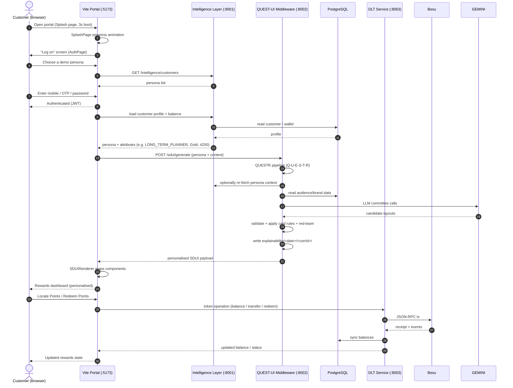

### 15.2 Step-by-step narrative, in depth

1. **Splash** — The user opens the portal (`main.tsx` mounts `App` inside the MUI `ThemeProvider`);
   `SplashPage` runs a three-second boot animation with a white logo card and a lime progress bar
   over a black background.
2. **Log on** — `AuthPage` presents the Lloyds "Log on" screen; the user can pick a **demo persona**
   served by the intelligence layer (`GET /intelligence/customers`), then proceed through the OTP and
   password flows (`OtpStep`, `PasswordStep`) with `App.handleSignInWithPassword` calling
   `loginWithPassword`.
3. **Auth** — Credentials are verified (PBKDF2-SHA256 on the loyalty rails; JWT issuance on the
   unified app); the client stores the token via `rewardsApi.ts`.
4. **Profile load** — `App.loadDashboardData` calls the intelligence layer / summary endpoints to
   obtain the persona classification, tier, and points (e.g. LONG_TERM_PLANNER, Gold, 4250).
5. **SDUI composition** — the frontend calls `POST /sdui/generate`; the middleware runs the
   Q-U-E-S-T-R committee, validates, red-teams, and writes the Explainability Record, then returns a
   personalised SDUI payload.
6. **Rendering** — `SDUIRenderer` walks the payload and mounts per-persona cards via
   `componentRegistry`.
7. **Token operations** — redeeming/transferring goes through the DLT service to Besu (JSON-RPC),
   with balances synced back to PostgreSQL.

### 15.3 The rewards-flow variants (from the flow documentation)

The `REWARDS_APPLICATION_FLOW.md` documents several supporting journeys that a rebuild should also
support. **Login** (`MobileStep` → `App.handleSignInWithPassword` → `loginWithPassword` →
`POST /api/v1/customers/login/password` → success → home). **Dashboard load** (
`BankHomePage` → `onOpenRewards` → `setStep('dashboard')` → `loadDashboardData` fetching summary,
brands, earned rewards, and latest wallet tx). **Rewards fetch** (`fetchEarnedRewardMapByBrand` →
`GET /rewards?customer_id=...&status=EARNED&limit=500` → a `brandId → rewardId` map). **Locate /
link brands** (`LocatePointsModal`: select a brand group, pick a brand, enter a contact, validate an
OTP-ish code, optionally redirect to the partner app). **Redeem** (`RedeemPointsModal`: browse and
filter a connected-brand catalogue, then confirm a partner redirect). **Activity/transactions** (the
dashboard's activity tab calls `fetchWalletTransactions`). All of these sit on top of — and mostly
*below* — the SDUI personalisation layer, and all must keep working for the demo to feel complete.

---

## 16. QUEST-UI MULTI-AGENT WORKFLOW

### 16.1 The committee-of-agents pattern, in depth

The middleware implements a **committee-of-agents** pattern using LangGraph. Rather than one giant
LLM prompt, the problem is decomposed into six focused stages, each led by a specific agent with
supporting agents, and each gated by a quality gate. This decomposition is what makes the output
both **higher quality** (each agent specialises and is less likely to conflate concerns) and
**governable** (guardian agents with veto authority can stop an unsafe composition regardless of its
score). The graph is defined in `middleware/workflow/graph.py` (1,665 lines), orchestrated by
`middleware/services/orchestration_service.py`. The full protocol — including the deliberation
rounds, the agent message contract, and the release rule — is codified in `SYSTEM ROLE.txt` and
documented in `EXPLANATION.md`.

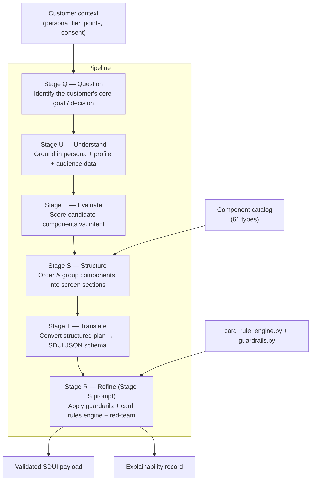

### 16.2 Stage responsibilities, in depth

| Stage | Name | Purpose | Lead agent |
|---|---|---|---|
| **Q** | Question | Determine the customer's real objective and frame the task charter | Orchestrator |
| **U** | Understand | Build a grounded, evidence-based understanding of the customer | Context Analyst |
| **E** | Evaluate | Score candidate components/strategies vs. the customer intent | Synthesiser |
| **S** | Structure | Assemble components into ordered, governed screen sections | Component Planner |
| **T** | Translate | Serialise the approved plan into the SDUI JSON contract | SDUI Compiler |
| **R** | Refine | Apply guardrails, validate, and red-team the final result | Red-Team Challenger |

Each stage has its own **quality gate**. Stage Q requires a clear task, valid purpose/consent, and
available policies/registries; if the gate fails, the middleware stops personalisation and returns
the neutral fallback with a recorded failure. Stage U requires all evidence to be permitted,
traceable, current, and purpose-compatible, with every inference carrying a confidence value and
evidence references; invalid evidence is removed and the stage re-run once before falling back.
Stage E evaluates **at least two candidate strategies** unless the constitution allows only one or
the request is a fallback, scoring on an eight-weight scorecard (see below) and applying ten hard
gates that cannot be compensated by a higher weighted score.

### 16.3 The evaluation scorecard

Candidates are scored on the approved scorecard, and the weights are worth preserving precisely
because they encode business priorities:

| Criterion | Weight |
|---|---|
| `customerGoalRelevance` | 25% |
| `expectedCustomerUtility` | 20% |
| `rewardProfileAlignment` | 15% |
| `accessibilityAndCognitiveFit` | 15% |
| `evidenceConfidence` | 10% |
| `brandAndDesignConsistency` | 5% |
| `usefulNovelty` | 5% |
| `operationalFeasibility` | 5% |

The ten **hard gates** are consent, purpose limitation, privacy, UI Constitution compliance,
component availability, content approval, accessibility minimums, conduct and fairness,
jurisdictional policy, and schema compatibility. Any hard-gate failure is fatal regardless of score.

### 16.4 Deliberation rounds and the message contract, in depth

The committee does **not** run an uncontrolled free-form group chat. It runs eight ordered rounds:
(1) **independent analysis** (Context Analyst, Journey/Intent, Reward Psychology, Accessibility,
Component Planner); (2) **governance challenge** (Consent, Constitution, and Risk/Fairness
Guardians); (3) **candidate revision** (Component Planner revises using valid objections);
(4) **evaluation** (Synthesiser scores all compliant candidates); (5) **red-team** (Red-Team
Challenger tests the winner and fallback); (6) **decision** (Orchestrator approves the highest-
scoring candidate passing all gates); (7) **compilation** (SDUI Compiler produces schema-valid
payloads); and (8) **final validation and persistence** (Validator checks, Explainability Writer
persists durably, and only then is the personalised SDUI released). Every explicit agent message is
a structured object (messageId, sequence, timestamp, stage, round, fromAgent, toAgents, messageType
of OBSERVATION/PROPOSAL/CHALLENGE/RESPONSE/VOTE/VETO/APPROVAL, summary, claims with evidenceRefs and
confidence, recommendedActions, objections, candidateRefs, policyRefs, modelVersion). Hidden chain-
of-thought is never stored; only explicit, reviewable artifacts are.

### 16.5 The Release Rule, in depth

The final SDUI may be released **only if** every hard-policy guardian returns PASS, no unresolved
CRITICAL or HIGH objection remains, schema and registry validation pass, evidence confidence meets
the threshold, the fallback UI is valid, and the Explainability Record has been durably written. If
any of these fails, the middleware **does not release the personalised SDUI** — it returns the
neutral fallback and stores the failure and responsible gate. This release rule is the operational
embodiment of the system's fairness and trust guarantees, and it is the behaviour a rebuild must
reproduce so that a bad or unverifiable composition can never reach a customer.

---

## 17. DLT BLOCKCHAIN OPERATION FLOW

### 17.1 The on-chain flow, in depth

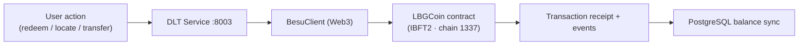

The diagram is intentionally simple because the service is intentionally thin: it is a guard at the
edge of the chain, not a place where business logic accumulates. Every operation reduces to the same
five-step pattern — validate, sign, submit, await consensus, sync — which keeps the codebase small
and auditable. The `BesuClient` in `dlt/app/blockchain/client.py` is the only code in the entire
system that speaks Web3 JSON-RPC; everything else, the frontend included, talks to this client
through the REST API.

### 17.2 On-chain mechanics, in depth

1. The portal requests a token operation (e.g. a redemption that spends LBG coins).
2. The **DLT Service** validates the request and builds a signed transaction using the configured
   bank/validator key.
3. **BesuClient** submits the transaction to Hyperledger Besu via JSON-RPC.
4. Besu reaches **IBFT 2.0** consensus and emits a receipt/event.
5. The DLT service persists the resulting balance change back to PostgreSQL.
6. The frontend refreshes the customer's coin balance.

### 17.3 Besu node surface

| Interface | Port | Enabled APIs |
|---|---|---|
| JSON-RPC (HTTP) | `8545` | `ETH, NET, WEB3, IBFT, TXPOOL, DEBUG, TRACE` |
| WebSocket | `8546` | `ETH, NET, WEB3, IBFT, TXPOOL` |

The node runs from `besu/genesis/genesis-ibft.json` (IBFT 2.0 genesis) with `besu/config/config.toml`
(a validator key), a `--min-gas-price=0` setting (so POV transactions are essentially free), and a
broad host allowlist for development convenience.

---

## 18. COMPONENT CATALOG & LIBRARY

### 18.1 The catalog, in depth

The full catalog lives in `middleware/catalog/component_catalog.py` (**61 component types**) and is
mirrored as React cards in `src/renderer/componentRegistry.tsx` plus the actual card components in
`src/components/rewards-intelligence/`. The catalog is a **single source of truth** for what the
system is allowed to compose: the middleware's `Component Planner` may only select from these types,
the `UI Constitution Guardian` forbids inventing new ones, and the `SDUI Compiler` validates that
anything emitted is a registered and schema-compatible component. On the frontend, `componentRegistry.tsx`
is the mirror that maps each type name to a React component. Keeping these two mirrors in alignment
is a critical maintenance concern: if the backend advertises a type the frontend does not know how
to render, the `SDUIRenderer` will safely skip it, but the experience will be degraded — which is
why the schema and registry validations in the middleware are non-negotiable.

### 18.2 Original 31 SDUI components

(Served as the base client-rendered set; includes balance, goals, projection, streak, challenge,
leaderboard, badge, expiring/alerts, re-engagement/quick-win components, etc.) These 31 form the
foundation that the personalisation-first components extend.

### 18.3 Personalisation-first components (catalog)

| Group | Components |
|---|---|
| **Educational** | `LEARNING_PATH_CARD`, `DAILY_MONEY_TIP_CARD`, `POINTS_ACADEMY_BADGE_CARD`, `MYTH_OR_FACT_CARD`, `SAVINGS_CALCULATOR_CARD` (Recharts area), `COACH_TIP_CARD`, `HOW_POINTS_WORK_CARD` |
| **Goal rewards & automation** | `GOAL_TEMPLATE_GALLERY`, `MILESTONE_REWARD_LADDER`, `GOAL_STREAK_CARD`, `GOAL_MATCH_BOOST_CARD`, `SHARED_GOAL_CARD`, `GOAL_AT_RISK_CARD`, `AUTO_RULES_CARD`, `GOAL_COMPLETE_CELEBRATION` |
| **Money-smart** | `BEST_VALUE_REDEEM_CARD`, `SAVINGS_TRANSFER_CARD`, `TRAVEL_FUND_CARD` |
| **Analytics (Recharts)** | `EARN_BREAKDOWN_CARD` (donut), `MONTH_OVER_MONTH_CARD` (bars), `POINTS_HEALTH_SCORE` (radial gauge) |
| **Social & community** | `PEER_INSIGHT_CARD`, `COMMUNITY_CHALLENGE_CARD` |
| **Lifecycle** | `MILESTONE_ANNIVERSARY_CARD`, `BIRTHDAY_REWARD_CARD` |
| **Discovery** | `NEW_BRAND_SPOTLIGHT_CARD`, `LOCAL_DEALS_CARD` |
| **Control & giving** | `PREFERENCES_CARD`, `GIFT_DONATE_CARD`, `REFERRAL_CARD` |

### 18.4 Example persona → composition mapping, in depth

| Customer | Persona | Typical composition |
|---|---|---|
| `customer_003` | LONG_TERM_PLANNER | goal cards ×3 + `ADD_GOAL_CARD`, `FUTURE_VALUE_CARD`, `PROJECTION_CHART` |
| `customer_005` | GAMIFICATION_MOTIVATED | `STREAK_CARD`, `CHALLENGE_CARD`, `LEADERBOARD`, `BADGE_CARD` |
| `customer_004` | CHURN_RISK | `EXPIRING_POINTS_ALERT`, `REENGAGEMENT_BANNER`, `QUICK_WIN_CARD` |

These mappings are the *observable* output of the committee, and they are the fastest way to verify
a rebuild: log in as `customer_003`, `customer_005`, and `customer_004`, and confirm each dashboard
composition matches its persona's archetype above.

### 18.5 Dashboard sections (from the screens reference)

The rewards dashboard is conceptually divided into the sections described in
`screens/screen-1/second page.txt`: **"Where you stand"** (balance/health), **"What can you do
next"** (recommended actions), **"Wins and milestones"** (achievements), and **"Your rewards and
your control"** (redemption + preferences). These map naturally onto the SDUI payload's `sections`
array, and a rebuild should align its default/fallback layout with these four conceptual regions.

> **Known limitation:** in the current POV, the dashboard cards are visual placeholders and the
> `second page.txt` notes the cards currently *lack functional links*. This is a documented
> simplification, not a design intent — see Section 22.

### 18.6 Generation guardrails, in depth

The middleware's Stage R / Refine prompt enforces content-level guardrails on top of the structural
rules: **at most one educational and one analytics component per screen** (to avoid cognitive load
and avoid turning every screen into a lesson or a dashboard), and **celebration / birthday /
anniversary components appear only when the customer profile genuinely supports them** (you do not
show a birthday reward unless the data says it is a birthday). These guardrails live in
`middleware/guardrails/guardrails.py` and the `card_rule_engine.py`, and the `Accessibility and
Cognitive Load Agent` plus the `Red-Team Challenger` enforce them at runtime.

---

## 19. RUN / DEPLOY / CONFIGURATION

### 19.1 Running the whole stack, in depth

The fastest way to run the whole backend is Docker Compose, which builds and starts every service in
dependency order with health checks. The frontend runs natively under Vite because it is a hot-reload
dev experience. The compose file wires `postgres` first (with schema+seed mounts), then `besu`, then
`dlt` (which needs both Postgres healthy and Besu started so it can deploy the contract), then
`intelligence-layer`, then `middleware` (which needs the intelligence layer, Postgres, and DLT). The
`initialise` ordering matters: `dlt` deploys the LBGCoin contract on startup and writes the address,
so it must come up before anything that needs the contract address.

### 19.2 Full orchestration (Docker Compose)

```bash
# From repo root — boots postgres, besu, dlt, intelligence, middleware
docker compose up --build
```

Ports exposed:

| Service | Host port | Container port |
|---|---|---|
| postgres | 5432 | 5432 |
| besu (RPC / WS / P2P) | 8545 / 8546 / 30303 | — |
| dlt | 8003 | 8000 |
| intelligence-layer | 8001 | 8000 |
| middleware | 8002 | 8000 |

### 19.3 Native (no Docker) backend

```bash
pip install -r intelligence-layer/requirements.txt
pip install -r middleware/requirements.txt

uvicorn app.main:app --port 8001            # from intelligence-layer/
# from middleware/, with the intelligence URL set:
INTELLIGENCE_SERVICE_URL=http://localhost:8001 uvicorn app.main:app --port 8002
```

### 19.4 Middleware keys

The middleware reads `GEMINI_API_KEY` from `middleware/.env`. Optionally `GROQ_API_KEY` and
`GROQ_MODEL` are used for the low-cost escape-hatch.

### 19.5 Frontend

```bash
npm install
npm run dev          # http://localhost:5173
```

### 19.6 Database shell (inside compose)

```bash
docker compose exec postgres psql -U ilrp -d ilrp
```

### 19.7 Deployment diagram

```mermaid
flowchart TB
    subgraph Host["Single host / Docker host"]
        subgraph Compose["docker compose"]
            PG[postgres:15-alpine]
            BESU[besu 24.12.2]
            DLT[dlt]
            IL[intelligence-layer]
            MW[middleware]
        end
        VITE[npm run dev Vite :5173<br/>(or dist/ static build)]
    end
    VITE --> IL
    VITE --> MW
    VITE --> DLT
```

### 19.8 Developer onboarding quick-start (from the flow documentation)

For a brand-new developer, the fastest onboarding is: (1) `cd` and `npm install`, (2) `npm run dev`
for the frontend, and (3) `docker compose up -d` for the backend, then open `http://localhost:8000/docs`
for the layered-backend API docs or the service ports for the other services. The most important
files to read first are `src/App.tsx` (state and flow), `src/services/rewardsApi.ts` (API
contracts), `src/pages/RewardsDashboardPage.tsx` (business-facing UI), `backend/app/api/v1/customers.py`
plus `backend/app/services/customer_service.py` (identity + dashboard semantics), and
`backend/app/models/models.py` (data model relationships). Common troubleshooting: for login
failures verify the backend is seeded and check the `/customers/login/password` response; for empty
dashboard data check `VITE_API_BASE_URL` and the summary endpoints; for missing transactions verify
the wallet-transactions endpoint returns rows; for backend startup issues inspect
`docker compose logs -f backend` and confirm `postgres`, `redis`, and `besu-validator-1` are healthy.

---

## 20. ENVIRONMENT VARIABLES REFERENCE

### 20.1 Why env config matters, in depth

The entire system is wired through environment variables because a bank's deployment topology varies
— service URLs, keys, and contract addresses must never be hard-coded. `docker-compose.yml` is the
master wiring diagram, and each service has a small surface of env vars. Keeping keys (`BANK_PRIVATE_KEY`,
`GEMINI_API_KEY`, `GROQ_API_KEY`) out of the repo is a non-negotiable security rule.

### 20.2 Frontend (`.env`)

| Variable | Purpose |
|---|---|
| `VITE_INTELLIGENCE_API_URL` | Base URL for intelligence service (default `http://localhost:8001`) |
| `VITE_MIDDLEWARE_API_URL` | Base URL for middleware (default `http://localhost:8002`) |
| `VITE_API_BASE_URL` | Generic API base URL |

### 20.3 DLT service (`docker-compose` / env)

| Variable | Purpose |
|---|---|
| `BESU_RPC_URL` | Besu JSON-RPC endpoint (compose: `http://besu:8545`) |
| `BESU_CHAIN_ID` | `1337` |
| `BANK_PRIVATE_KEY` | Signing key for on-chain ops (keep out of repo) |
| `BANK_ONCHAIN_ADDRESS` | Bank address (default `0xA64dFE27e652ee3A38f42888C2d570E39CA479E7`) |
| `CONTRACT_ADDRESS_FILE` | `/app/deployed/contract_address.txt` |
| `CONTRACTS_DIR` | `/app/contracts` |
| `DATABASE_URL` / `DB_*` | PostgreSQL connection |

### 20.4 Intelligence layer

| Variable | Purpose |
|---|---|
| `DATABASE_URL` | PostgreSQL connection |
| `BESU_RPC_URL` | Besu endpoint |
| `LBGCOIN_CONTRACT_ADDRESS` | LBGCoin contract address |
| `DLT_SERVICE_URL` | `http://dlt:8000` |

### 20.5 Middleware

| Variable | Purpose |
|---|---|
| `INTELLIGENCE_SERVICE_URL` | `http://intelligence-layer:8000` |
| `DLT_SERVICE_URL` | `http://dlt:8000` |
| `DATABASE_URL` | PostgreSQL connection |
| `GEMINI_API_KEY` | Gemini LLM key |
| `GROQ_API_KEY` | Groq fallback key |
| `GROQ_MODEL` | `openai/gpt-oss-120b` (default) |

### 20.6 Layered-backend env vars (from the flow documentation)

For the legacy layered backend, additional variables exist: `DATABASE_URL` and `DATABASE_URL_SYNC`
(async + sync connections), `REDIS_URL`, `BESU_RPC_URL` and `BESU_CHAIN_ID`, `PRIVATE_KEY` (signer),
`CONTRACTS_DIR` / `DEPLOYED_DIR`, and optional explicit contract addresses
(`LBG_COIN_CONTRACT_ADDRESS`, `WALLET_REGISTRY_CONTRACT_ADDRESS`, `REWARD_MANAGER_CONTRACT_ADDRESS`),
plus `LOG_LEVEL` and `ENVIRONMENT`. These confirm the same "keys out of repo, addresses overridable"
design.

---

## 21. SECURITY & EXPLAINABILITY

### 21.1 Security controls, in depth

Security in this application is layered. **Authentication** starts with PBKDF2-SHA256 password
hashing and timing-safe digest comparison on the credential check, then (on the unified app) issues
a **JWT** that the frontend stores and sends with subsequent authenticated calls. **Key hygiene** is
strict: `BANK_PRIVATE_KEY`, `GEMINI_API_KEY`, and `GROQ_API_KEY` are supplied via environment, never
committed, and the DLT service only ever signs through the configured validator key. **Sandboxing**
isolates the blockchain PoC on a private Besu network (chain id 1337) so nothing touches a public
chain or real funds. **Input validation** on the middleware (`validators/`) validates every SDUI
payload against schema before it is returned, and the `SDUI Compiler` never emits unregistered
components. **Data minimisation** is enforced: the middleware must not store secrets, tokens, or raw
customer behavioural histories, must redact/tokenise customer identifiers, and must not insert
personal data into file names.

| Control | Mechanism |
|---|---|
| Authentication | PBKDF2-SHA256 + JWT (unified app) |
| Key hygiene | Env-only private/LLM keys |
| Sandboxing | Private Besu, chain 1337 |
| Input validation | `middleware/validators/` (schema + coherence) |
| Data minimisation | Redacted records, no secrets/tokens |
| Consent enforcement | `Consent Guardian` + purpose-of-use gate |
| Fairness | Guardian vetoes + red-team; no dark patterns |

### 21.2 Explainability / audit, in depth

Every SDUI composition is persisted as exactly one immutable **Explainability Record** at
`middleware/explainability/<date>/<correlationId>/` (see Section 10.5 for the full eleven-file
breakdown). This provides *what* was served to which (pseudonymous) customer, *why* — which persona
and which stage decisions drove it — and a correlation id to trace the whole pipeline run end-to-end,
together with hashes of the final and fallback payloads and the record-integrity hash. Combined with
the strict **Release Rule** (release only after every guardian passes, no unresolved CRITICAL/HIGH
objections, all validations pass, confidence threshold met, fallback valid, record durably written),
this satisfies the *bank-grade* requirement that AI decisions be auditable, reproducible, and
contestable. A rebuild that wants to be production-trustworthy must reproduce both the record
format and the release rule; together they are the answer to the question "who decides what a
customer sees, and how do we prove it was fair?"

---

## 22. KNOWN LIMITATIONS & CURRENT STATE

### 22.1 Current-state caveats, in depth

The POV is a demonstration, not a production deployment, and several documented simplifications
should be understood before a rebuild is scoped. First, **the dashboard cards are visual
placeholders** — `screens/screen-1/second page.txt` explicitly notes the cards currently *lack
functional links*; the personalisation proves the composition logic, but the cards do not yet perform
the redemptions/actions they advertise. Second, **`MobileStep.tsx` is dead code** in the current
unification — it is orphaned (no imports reference it) and the active flow runs through
`AuthPage.tsx` with `OtpStep`/`PasswordStep`; a rebuild should delete or re-integrate it deliberately. Third,
**the login screenshots** in `screens/screen-1/` cannot be analysed as images here; their content is
derived from source code, so any screenshot-specific styling must be verified against the source.
Fourth, **the `backend/` folder is an alternate/legacy layered implementation** of the loyalty rails
alongside the intelligence/middleware/DLT trio — both are valid references, and a rebuild must pick a
primary path and keep them consistent. Fifth, **LLM dependence**: personalised layout requires
Gemini/Groq and degrades gracefully to the static layout if the LLM is unavailable or cost-capped.
Finally, **persona realism**: the demo personas are illustrative customer archetypes, not production
customer data, and the reward interaction profile is explicitly a temporary, purpose-bound
interpretation — never a permanent label.

### 22.2 Divergence between the two lineages, in depth

The `REWARDS_APPLICATION_FLOW.md` lineage documents **JWT-less** authentication (phone/password
verification returning customer data directly, with no server-issued session token and no
router-level guards, access being UI-step based), while the **current unified app adds JWT handling**
through `rewardsApi.ts`. Similarly, the flow documentation describes password hashing with
PBKDF2-SHA256 and no global state store, both of which are retained. The practical reconciliation
for a rebuild is: keep PBKDF2-SHA256 as the credential verification, add JWT issuance for the unified
app's authenticated API calls, and keep the step-based state machine (no router) exactly as both
lineages agree it should be. The key point is that the current `ILRP-app` is the *merged* source of
truth, and `REWARDS_APPLICATION_FLOW.md` remains the authoritative deep reference for the loyalty
rails' mechanics.

### 22.3 What a rebuild must reproduce versus what it may simplify

Reproduce without question: the **anchor-vs-dynamic UI split** (fixed header, SDUI body, static
fallback); the **Q-U-E-S-T-R committee** with guardian vetoes, the scorecard, and the Release Rule;
the **61-component catalog** mirrored on both backend and frontend; the **immutable Explainability
Record**; the **LBG coin ledger on Besu** with address + env-key signing; the **persona-driven
login picker**; and the **four rewards journeys** (summary, locate/link, redeem, activity). May
simplify for a lighter demo: the full eleven-file Explainability Record depth, the layered
`backend/` implementation (if the intelligence/middleware/DLT trio is the chosen primary path), and
the eight-persona spread (a three-persona demo exercising the three archetypes above is enough to
tell the story).

---

## 23. COMPANION PROOF-OF-CONCEPT APPS

### 23.1 The companion apps, in depth

Under the same repo, two sibling Vite/React apps model partner-brand engagement and prove that the
LBG coin concept extends beyond the main portal into the partner ecosystem. They exist to
demonstrate how a customer earns points *while shopping with a partner*, and how those points flow
back into the consolidated LBG wallet in the main portal — completing the cross-brand story that the
business goals demand.

- **`Alphamed/`** — a partner-brand loyalty PoC (contains its own `ALPHAMEDICOL_FLOW_GUIDE.md`),
  modelling a pharmacy/health partner's loyalty experience. It shows a customer earning and viewing
  health-related rewards, reinforcing the "life-event/health" personalisation angle.
- **`Cavendish-online/`** — a second partner-brand PoC, modelling a retail/e-commerce partner's
  rewards experience, reinforcing the everyday-shopping earn angle.

Both reuse the brand-consistent design language (Lloyds green, Inter, card-based layouts) and
preview how LBG coins would be earned and shown across the partner ecosystem. From an architecture
perspective they are independent frontends; in a full production vision they would call the same
intelligence/middleware/DLT APIs, but for the POV they stand alone as visual references. Their
existence is a strong hint to a rebuild: the consolidation story requires *both* the main portal
(show the unified wallet) *and* the partner apps (show the earning side), even if only as demos.

---

## 24. APPENDIX & GLOSSARY

### 24.1 ASCII architecture diagram (bare text)

```
                          ┌─────────────────────────────┐
                          │      Browser / Portal       │
                          │  Vite · React · TS · :5173  │
                          │  SDUIRenderer + registry    │
                          └───────┬─────────┬───────────┘
                                  │         │
                 persona / auth   │         │ POST /sdui/generate
                  (JWT)           │         │
                          ┌───────▼───┐  ┌──▼──────────────────────┐
                          │Intelligence│ │ QUEST-UI Middleware :8002│
                          │  Layer     │ │  Q-U-E-S-T-R LangGraph   │
                          │  :8001     │ │  Gemini / Groq           │
                          └───────┬───┘ │  validators + card rules  │
                                  │     └─┬─────────────────────┬───┘
                                  │       │ explainability      │
                          ┌───────▼────┐ ┌▼──────────────┐  ┌───▼────┐
                          │ PostgreSQL │ │  DLT :8003    │  │explain │
                          │  :5432     │ │  BesuClient   │  │ /logs  │
                          └────────────┘ └─┬───────────┬─┘  └────────┘
                                           │JSON-RPC   │sync
                                      ┌────▼────────────▼──┐
                                      │ Hyperledger Besu   │
                                      │ IBFT2 · chain 1337 │
                                      │ LBGCoin contract   │
                                      └────────────────────┘
```

### 24.2 Glossary (from the flow documentation plus this baseline)

| Term | Meaning |
|---|---|
| **LBG Coins** | Unified coin balance shown in the rewards dashboard, backed by the wallet model and the Besu LBGCoin contract |
| **Reward Interaction Profile** | Purpose-bound, time-boxed behavioural interpretation of a customer; NOT a permanent "personality" |
| **Brand Points Ledger** | Per-brand per-customer allocation (`available`/`reserved`/`redeemed`) |
| **EARNED Reward** | Reward status indicating points eligible for conversion |
| **Conversion** | Transforming brand-earned points into LBG wallet value |
| **Redemption** | Spending wallet/coin value against a brand or checkout flow |
| **Consolidation / Locate** | UX flow to link/add points from external or LBG brands (`LocatePointsModal`) |
| **SDUI** | Server-Driven UI — the server composes the screen layout, the client renders it |
| **QUESTR / Q-U-E-S-T-R** | Question → Understand → Evaluate → Structure → Translate → Refine |
| **Held-governance** | Guardian agents (consent/constitution/risk) with veto authority over compositions |
| **Explainability Record** | Immutable, hashed audit of what was shown and why (`middleware/explainability/...`) |
| **Besu** | Hyperledger Besu private blockchain used for the LBG coin ledger (IBFT2, chain 1337) |

---

*End of BASE-LINE-2. This expanded edition adds a deep explanatory paragraph (typically 200–300+
words) to every heading and section, preserves all original content and diagrams, weaves in the
detailed loyalty-rails mechanics from `REWARDS_APPLICATION_FLOW.md`, and documents the governed
QUEST-UI committee so a developer with zero prior context can rebuild the ILRP rewards POV to full
fidelity from scratch.*
