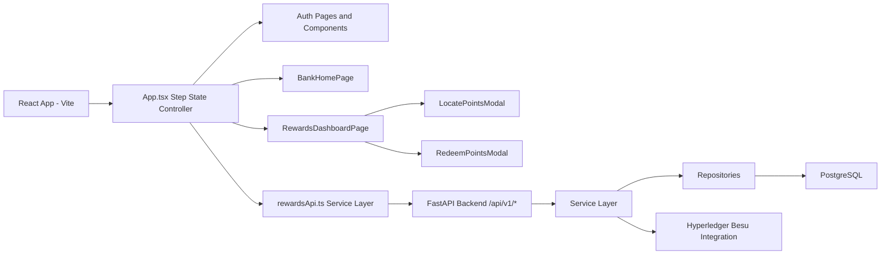
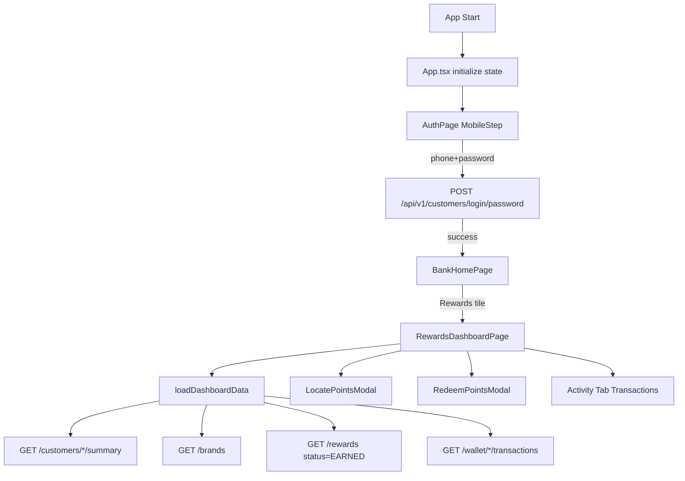
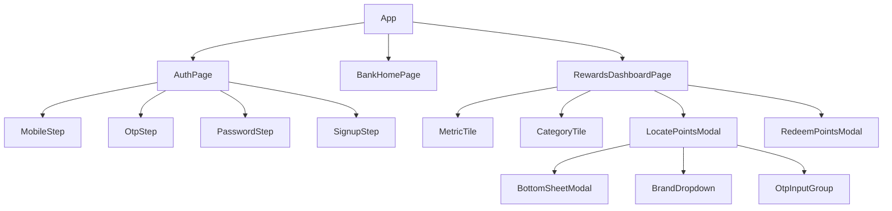
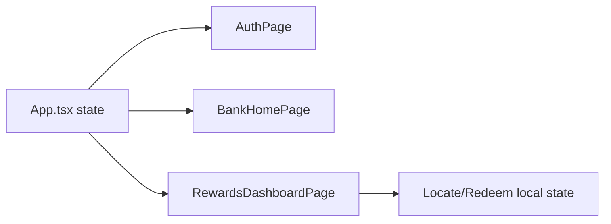
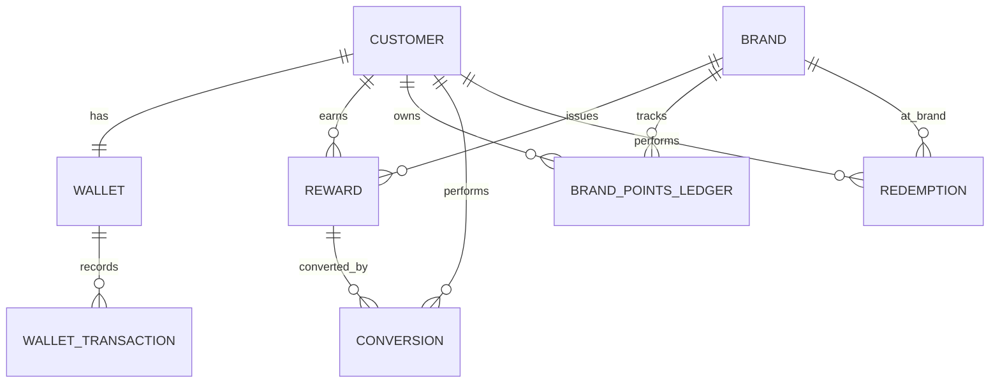
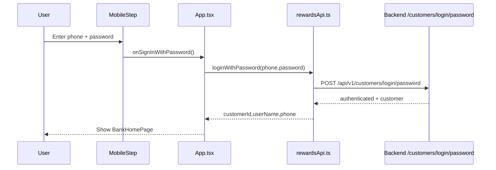
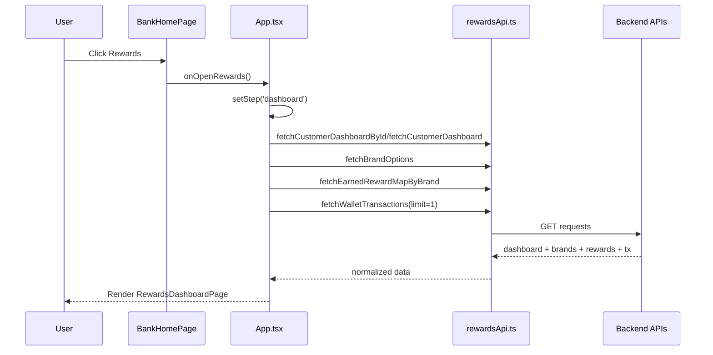
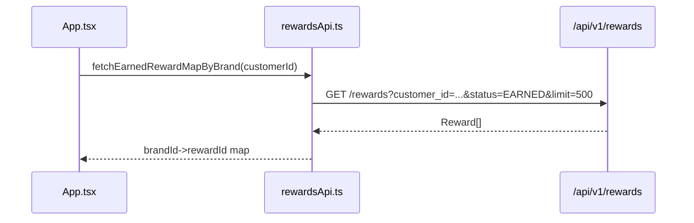
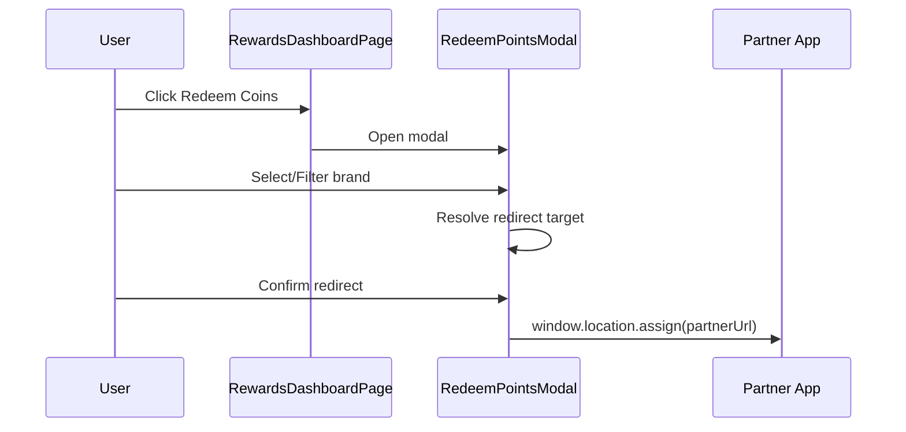

# Rewards Application - Complete Technical Documentation

## 1. Project Overview

### Purpose of the application
Unified Rewards is a mobile-first rewards experience that:
- Authenticates a customer using phone + password.
- Shows a Lloyds-style home screen.
- Navigates into a rewards dashboard.
- Aggregates brand points into LBG coins.
- Supports rewards exploration, consolidation flows, and transaction history.

Frontend reference root:
- `ILRP-Frontend/unified-rewards`

Backend reference root:
- `interopable-rewards-ecosystem/backend`

### Business objectives
- Provide a single customer rewards wallet across multiple partner brands.
- Show a clear loyalty tier journey (Silver/Gold/Platinum).
- Enable points discovery and redemption journeys.
- Integrate with a blockchain-backed rewards ledger via backend services.

### Key user journeys
1. Login with phone + password.
2. Land on bank-style home page.
3. Open Rewards dashboard.
4. Review coins, tier progress, eligible brands, and insights.
5. Open modals for consolidation/redeem flows.
6. View transaction history in activity tab.

### High-level architecture


## 2. Technology Stack

### Frontend technologies used
- React 19
- TypeScript
- Vite
- MUI (`@mui/material`, `@mui/icons-material`)
- Emotion styling (`@emotion/react`, `@emotion/styled`)

### Backend technologies used
- Python 3.13
- FastAPI
- SQLAlchemy 2.x
- Pydantic v2
- Web3.py

### Database technologies used
- PostgreSQL 16
- Redis 7 (available in stack)

### State management libraries
- No Redux/Zustand/Context global store.
- State is local component state (`useState`, `useEffect`, `useMemo`) in `src/App.tsx` and page components.

### UI frameworks
- Material UI (MUI)
- CSS files (`src/App.css`, `src/index.css`)

### Authentication mechanisms
- Backend password hashing and verification with PBKDF2-SHA256 in `backend/app/utils/passwords.py`.
- Frontend login using `POST /api/v1/customers/login/password`.
- No JWT/session token issuance currently.

### External APIs and integrations
- Internal REST APIs under `/api/v1/*`.
- Hyperledger Besu blockchain integration through backend services.

## 3. Project Structure

### Tree view (focused scope)
```text
ILRP-Frontend/unified-rewards/
  src/
    App.tsx
    App.css
    index.css
    main.tsx
    assets/
    components/
      auth/
      dashboard/
      forms/
      ui/
    pages/
      AuthPage.tsx
      BankHomePage.tsx
      RewardsDashboardPage.tsx
    services/
      rewardsApi.ts
    types/
      rewards.ts
  package.json
  vite.config.ts
  tsconfig*.json
  index.html

interopable-rewards-ecosystem/
  backend/
    app/
      api/v1/
      services/
      repositories/
      models/
      schemas/
      database/
      config/
      middleware/
      blockchain/
      utils/
      events/
      main.py
    requirements.txt
    Dockerfile
  docker-compose.yml
  README.md
  run.txt
```

### Folder responsibilities

| Folder | Purpose | Responsibilities | Key files |
|---|---|---|---|
| `src` | Frontend source root | App composition, bootstrapping, styling | `src/main.tsx`, `src/App.tsx` |
| `src/components` | Reusable UI building blocks | Auth steps, dashboard modals/cards, form controls, modal shell | `components/auth/*`, `components/dashboard/*`, `components/forms/*`, `components/ui/BottomSheetModal.tsx` |
| `src/pages` | Page-level compositions | Step dispatcher, home screen, rewards dashboard | `pages/AuthPage.tsx`, `pages/BankHomePage.tsx`, `pages/RewardsDashboardPage.tsx` |
| `src/services` | API abstraction layer | HTTP calls, payload mapping, response normalization | `services/rewardsApi.ts` |
| `src/hooks` | Custom hooks | Not present in current codebase | N/A |
| `src/contexts` | Context providers | Not present in current codebase | N/A |
| `src/assets` | Static visual resources | Logos, icons, card images, category artwork | multiple png/svg files |
| `src/utils` | Shared utility functions | Not present (helpers live inside files) | N/A |
| `src/routes` | Router config | Not present (step-based state machine used instead of router) | N/A |
| `backend/app/api/v1` | HTTP endpoint layer | Defines REST endpoints and delegates to services | `customers.py`, `rewards.py`, `wallets.py`, `conversions.py`, `redemptions.py`, `payments.py`, `brands.py`, `blockchain.py` |
| `backend/app/services` | Business logic layer | Reward lifecycle, customer auth, conversion/redemption/payment flows | `customer_service.py`, `conversion_service.py`, `redemption_service.py`, `payment_service.py`, etc. |
| `backend/app/repositories` | Data access layer | Encapsulates SQLAlchemy operations | `base.py`, `customer_repository.py`, `wallet_repository.py`, etc. |
| `backend/app/models` | ORM entities | Defines DB entities and relationships | `models.py` |
| `backend/app/schemas` | API schemas/contracts | Request/response validation | `customer.py`, `dashboard.py`, `wallet.py`, etc. |
| `backend/app/config` | Runtime config | Env-backed settings and logging config | `settings.py`, `logging_config.py` |
| `backend/app/database` | DB setup and seeding | Async DB session and demo seeding | `base.py`, `seed.py` |
| `backend/app/blockchain` | On-chain integration | Besu client and adapters | `client.py`, `adapters/*` |
| `backend/app/middleware` | Cross-cutting concerns | Error handling and request logging | `error_handler.py`, `logging_middleware.py` |
| `backend/app/events` | Internal eventing | Event bus and handler registration | `event_bus.py`, `handlers.py` |
| `backend/app/utils` | Shared backend utilities | Passwords, exceptions, mapping helpers | `passwords.py`, `exceptions.py`, `brand_name_mapping.py` |

### Configuration files
- Frontend: `package.json`, `vite.config.ts`, `tsconfig.json`, `tsconfig.app.json`, `tsconfig.node.json`, `eslint.config.js`.
- Backend/infra: `docker-compose.yml`, `backend/Dockerfile`, `backend/requirements.txt`, `backend/app/config/settings.py`.

## 4. Application Flow

### End-to-end flow narrative
1. Application startup:
- `src/main.tsx` mounts `App`.
- `App.tsx` initializes phone, step, and auth/dashboard state.

2. Routing initialization:
- No `react-router-dom` route map currently in source.
- UI route is step-driven with `AppStep` in `src/types/rewards.ts`.

3. Authentication process:
- `MobileStep` collects user ID (phone) and password.
- `App.handleSignInWithPassword` calls `loginWithPassword` in `services/rewardsApi.ts`.
- Backend validates in `CustomerService.login_with_password`.

4. Dashboard loading:
- Post-login step -> `home` (`BankHomePage`).
- Rewards tile click -> `dashboard` (`RewardsDashboardPage`).

5. Rewards retrieval:
- `App.loadDashboardData` calls:
  - customer summary (`fetchCustomerDashboardById` or `fetchCustomerDashboard`),
  - brands list (`fetchBrandOptions`),
  - earned rewards map (`fetchEarnedRewardMapByBrand`),
  - wallet tx latest (`fetchWalletTransactions`).

6. Reward redemption:
- Current UI opens `RedeemPointsModal`; this modal is primarily brand browsing + redirect flow.
- Backend supports redemption APIs; current frontend does not call redemption endpoint directly.

7. Brand integration:
- `LocatePointsModal` collects brand + contact + OTP-like input and can redirect to partner apps.

8. Transactions:
- In Rewards dashboard Activity tab, tx history loads from wallet transactions endpoint.

9. Error handling:
- Frontend catches errors in service calls and sets user-facing error state.
- Backend uses middleware + exceptions to return structured failures.

### Flow diagram


## 5. Component Documentation

> Scope includes all React components in `src/components` and page components in `src/pages`.

### `App`
- File path: `src/App.tsx`
- Purpose: Root application state machine and orchestration.
- Props accepted: none.
- State variables: mobile/auth/signup states, dashboard data states, selected step.
- Hooks used: `useState`, `useEffect`, `useRef`.
- Child components: `AuthPage`, `BankHomePage`, `RewardsDashboardPage`.
- Parent components: `main.tsx` root renderer.
- APIs called: all functions from `services/rewardsApi.ts` except conversion currently.
- Important business logic: step transitions (`mobile` -> `home` -> `dashboard`), login/signup handling, dashboard polling.

### `AuthPage`
- File path: `src/pages/AuthPage.tsx`
- Purpose: Step router for auth sub-views.
- Props accepted: full auth state/handlers.
- State variables: none (pure routing component).
- Hooks used: none.
- Child components: `MobileStep`, `OtpStep`, `PasswordStep`, `SignupStep`.
- Parent components: `App`.
- APIs called: none.
- Business logic: conditional render by `step` prop.

### `BankHomePage`
- File path: `src/pages/BankHomePage.tsx`
- Purpose: Post-login home screen and launch point into rewards dashboard.
- Props accepted: `userName`, `onOpenRewards`.
- State variables: none.
- Hooks used: none.
- Child components: MUI primitives only.
- Parent components: `App`.
- APIs called: none.
- Business logic: rewards quick action invokes `onOpenRewards`.

### `RewardsDashboardPage`
- File path: `src/pages/RewardsDashboardPage.tsx`
- Purpose: Main rewards experience (coins, tiers, insights, categories, activity, modals).
- Props accepted: customer identity + points + brands + refresh handler.
- State variables: modal toggles, active card index, bottom tab state, tx loading/error states.
- Hooks used: `useState`, `useEffect`, `useMemo`.
- Child components: `MetricTile`, `CategoryTile`, `LocatePointsModal`, `RedeemPointsModal`.
- Parent components: `App`.
- APIs called: `fetchWalletTransactions` (direct), and receives refreshed data via parent.
- Business logic: tier calculations, points normalization, transaction list rendering.

### `MetricTile`
- File path: `src/pages/RewardsDashboardPage.tsx`
- Purpose: Compact metric with optional hover/focus tooltip.
- Props accepted: `label`, `value`, `tone`, `textColor`, `valueColor`, `unit`, `infoText`, alignment options.
- State variables: none.
- Hooks used: none.
- Parent components: `RewardsDashboardPage`.

### `CategoryTile`
- File path: `src/pages/RewardsDashboardPage.tsx`
- Purpose: Display category icon + brand count in eligible brands grid.
- Props accepted: `label`, `count`, `icon`.
- State variables: none.
- Hooks used: none.
- Parent components: `RewardsDashboardPage`.

### `LocatePointsModal`
- File path: `src/components/dashboard/LocatePointsModal.tsx`
- Purpose: Modal flow for selecting partner brand and verifying contact before linking/redirect.
- Props accepted: `isOpen`, `brandOptions`, `onClose`, `onVerified`.
- State variables: step, group selection, selected brand, contact fields, OTP digits, redirect prompt states.
- Hooks used: `useState`, `useEffect`, `useMemo`, `useRef`.
- Child components: `BottomSheetModal`, `BrandDropdown`, `OtpInputGroup`.
- Parent components: `RewardsDashboardPage`.
- APIs called: none directly.
- Business logic: filters eligible brands, handles OTP UX, optional partner redirect.

### `RedeemPointsModal`
- File path: `src/components/dashboard/RedeemPointsModal.tsx`
- Purpose: Brand browsing and redemption-oriented modal with filtering/search and partner redirect confirmation.
- Props accepted: `isOpen`, `totalPoints`, `pointsData`, `customerName`, `onClose`.
- State variables: query/filter states, redirect dialog state.
- Hooks used: `useState`, `useMemo`.
- Child components: MUI Modal controls.
- Parent components: `RewardsDashboardPage`.
- APIs called: none directly.
- Business logic: builds connected brand catalog from points + fallback, then category/query filters.

### `MobileStep`
- File path: `src/components/auth/MobileStep.tsx`
- Purpose: Credential entry (phone/user-id + password) and continue action.
- Props accepted: mobile/password fields, handlers, submit/loading/error flags.
- Hooks used: none.
- Parent: `AuthPage`.
- Child components: MUI controls.

### `OtpStep`
- File path: `src/components/auth/OtpStep.tsx`
- Purpose: OTP UX screen.
- Props accepted: OTP state + callbacks.
- Hooks used: `useEffect`, `useMemo`, `useState`.
- Parent: `AuthPage`.

### `PasswordStep`
- File path: `src/components/auth/PasswordStep.tsx`
- Purpose: Dedicated password screen for sign-in path.
- Props accepted: mobile number, password, submit/back handlers.
- Parent: `AuthPage`.

### `SignupStep`
- File path: `src/components/auth/SignupStep.tsx`
- Purpose: New customer sign-up form.
- Props accepted: signup fields, validation/submit/back handlers.
- Parent: `AuthPage`.

### `BrandDropdown`
- File path: `src/components/forms/BrandDropdown.tsx`
- Purpose: Dropdown selector for brand options.
- Props accepted: label, placeholder, options, selected id, change callback.
- Parent: `LocatePointsModal`.

### `OtpInputGroup`
- File path: `src/components/forms/OtpInputGroup.tsx`
- Purpose: Reusable OTP input row.
- Props accepted: digits/refs and input event handlers.
- Parent: `LocatePointsModal`.

### `BottomSheetModal`
- File path: `src/components/ui/BottomSheetModal.tsx`
- Purpose: Generic bottom-sheet modal shell for form steps.
- Parent: `LocatePointsModal`.

### `PointsCard`, `YourPointsCard`, `LocatePointsCard`
- File paths:
  - `src/components/dashboard/PointsCard.tsx`
  - `src/components/dashboard/YourPointsCard.tsx`
  - `src/components/dashboard/LocatePointsCard.tsx`
- Purpose: dashboard card primitives / older components.
- Current usage: not central to active `RewardsDashboardPage` render path.

### Code relationships


## 6. Page Documentation

### `AuthPage`
- Route: step-based route (`mobile`, `otp`, `password`, `signup`).
- Purpose: auth container and step switch.
- Components used: auth step components.
- APIs invoked: none directly.
- State management: receives all state from `App`.
- Navigation flow: user actions call parent handlers to transition state.

### `BankHomePage`
- Route: step `home`.
- Purpose: post-login home UI.
- Components used: internal quick-action tiles.
- APIs invoked: none.
- State management: stateless display, callback trigger.
- Navigation flow: Rewards tile sets step -> `dashboard`.

### `RewardsDashboardPage`
- Route: step `dashboard`.
- Purpose: full rewards dashboard and activity.
- Components used: inline tiles + modals.
- APIs invoked: wallet transactions direct; parent refresh callback for broader data.
- State management: local UI state for tabs/cards/modals/loading.
- Navigation flow: home tab/activity tab toggle; opens modals; refresh hooks.

## 7. Function Documentation

### Frontend key functions (`src/App.tsx`)
| Function | Parameters | Return | Purpose | Usage |
|---|---|---|---|---|
| `handleMobileChange` | input event | void | sanitize/store 10-digit phone | MobileStep input |
| `handleOpenPasswordStep` | none | void | move to password step | Forgot/login flow |
| `handleOtpChange` | index, value | void | multi-digit OTP distribution | OtpStep |
| `handleOtpKeyDown` | index, key event | void | backspace navigation | OtpStep |
| `handleOtpPaste` | paste event | void | bulk OTP paste handling | OtpStep |
| `handleVerifyOtp` | none | void | OTP completion step transition | OtpStep verify |
| `handlePasswordChange` | input event | void | update password + clear login error | auth forms |
| `handleSignInWithPassword` | none | Promise<void> | call login API and set authenticated state | MobileStep/PasswordStep continue |
| `handleBackToMobile` | none | void | reset transient auth state | auth back actions |
| `handleOpenSignup` | none | void | switch to signup step | MobileStep |
| `handleSignupPhoneChange` | input event | void | sanitize signup phone | SignupStep |
| `handleSubmitSignup` | none | Promise<void> | call signup API then move to password step | SignupStep submit |
| `loadDashboardData` | none | Promise<void> | fetch summary/brands/rewards/tx snapshots | dashboard refresh + polling |

### Frontend key functions (`src/services/rewardsApi.ts`)
| Function | Endpoint | Method | Purpose | Return |
|---|---|---|---|---|
| `fetchCustomerDashboard` | `/api/v1/customers/lookup/summary` | GET | summary by phone | `DashboardData` |
| `fetchCustomerDashboardById` | `/api/v1/customers/{id}/summary` | GET | summary by customer id | `DashboardData` |
| `signupCustomer` | `/api/v1/customers/signup` | POST | create customer with password | `void` |
| `loginWithPassword` | `/api/v1/customers/login/password` | POST | authenticate customer | `{customerId,userName,phone}` |
| `fetchBrandOptions` | `/api/v1/brands` | GET | load partner brands | `BrandOption[]` |
| `fetchEarnedRewardMapByBrand` | `/api/v1/rewards?...` | GET | find EARNED reward ids by brand | `Record<string,string>` |
| `convertRewardById` | `/api/v1/convert` | POST | manual conversion by reward id | `void` |
| `fetchWalletTransactions` | `/api/v1/wallet/{id}/transactions` | GET | tx history | `WalletTransactionItem[]` |

### Frontend helper functions (`src/pages/RewardsDashboardPage.tsx`)
- `formatPoints`, `formatLastSyncedAt`, `formatTransactionDate`, `formatCurrencyGBP`, `normalizeTransactionDescription`, `getInitials`.
- Purpose: formatting and UX-friendly transaction/points labels.

### Backend key service methods
| Service | Method | Purpose |
|---|---|---|
| `CustomerService` | `signup_customer` | register customer + password hash |
| `CustomerService` | `login_with_password` | credential verification |
| `CustomerService` | `get_dashboard_summary` | aggregate customer + wallet + brand ledger |
| `CustomerService` | `get_dashboard_summary_by_contact` | contact-based dashboard lookup |
| `CustomerService` | `transfer_alphamedicol_points` | cross-brand transfer to LBG wallet |
| `RewardService` | reward creation methods | create brand-earned rewards + ledger sync |
| `ConversionService` | `convert_reward` | reserve/consume reward points and mint wallet credits |
| `RedemptionService` | redemption methods | spend wallet/brand points and track redemption records |
| `PaymentService` | `checkout` | payment + optional points redeem + earn flow |
| `WalletService` | wallet read methods | wallet details, tx list, summary |
| `BrandService` | CRUD methods | brand management |

### Example execution flow (login)
1. `MobileStep` calls `onSignInWithPassword`.
2. `App.handleSignInWithPassword` executes `loginWithPassword`.
3. `rewardsApi.loginWithPassword` posts phone+password.
4. Backend `customers.py` route calls `CustomerService.login_with_password`.
5. On success, `App` sets `userName`, `customerId`, and step to `home`.

## 8. Custom Hooks Documentation

No custom hooks are currently defined under `src/hooks`.
- The project relies on React built-in hooks directly inside components (`useState`, `useEffect`, `useMemo`, `useRef`).

## 9. Context Providers and State Management

No Context providers / Redux / Zustand stores are defined in current frontend code.

### Effective state design
- Root-level shared state in `App.tsx`.
- Localized UI state inside page/modal components.

### Data flow


## 10. Service Layer Documentation

### Frontend service: `rewardsApi.ts`
- File location: `src/services/rewardsApi.ts`
- Responsibilities:
  - HTTP endpoint calls.
  - API response normalization and typing.
  - mapping backend snake_case to frontend camelCase models.

### Backend service layer
- File location: `backend/app/services/*.py`
- Responsibilities:
  - Customer identity and summary aggregation.
  - Reward issuance and conversion.
  - Redemption and payment orchestration.
  - Wallet updates and transaction logs.

### Request and response structures (examples)
- Login request: `{ phone, password }`
- Login response: `{ authenticated, customer: { id, name, email, phone } }`
- Dashboard response: `{ customer, wallet, total_lbg_points, brand_points[] }`

### Error handling
- Frontend: throws descriptive `Error` from service functions on non-OK responses.
- Backend: raises HTTP exceptions and domain exceptions; middleware handles structured responses/logging.

## 11. Import and Dependency Analysis

### Frontend imports/exports summary (by file)

| File | Imports From | Exported Items | Consumed By |
|---|---|---|---|
| `src/main.tsx` | `react`, `react-dom/client`, `./App`, `./index.css` | none | entry point only |
| `src/App.tsx` | pages, `./App.css`, `services/rewardsApi`, `types/rewards` | default `App` | `src/main.tsx` |
| `src/pages/AuthPage.tsx` | auth components | default `AuthPage` | `src/App.tsx` |
| `src/pages/BankHomePage.tsx` | MUI + icons | default `BankHomePage` | `src/App.tsx` |
| `src/pages/RewardsDashboardPage.tsx` | MUI + icons + assets + modals + rewardsApi | default `RewardsDashboardPage` | `src/App.tsx` |
| `src/components/auth/MobileStep.tsx` | MUI + icons | default `MobileStep` | `AuthPage` |
| `src/components/auth/OtpStep.tsx` | MUI + icons | default `OtpStep` | `AuthPage` |
| `src/components/auth/PasswordStep.tsx` | MUI + icons | default `PasswordStep` | `AuthPage` |
| `src/components/auth/SignupStep.tsx` | MUI + icons | default `SignupStep` | `AuthPage` |
| `src/components/forms/BrandDropdown.tsx` | React + types | named `BrandItem`, default `BrandDropdown` | `LocatePointsModal` |
| `src/components/forms/OtpInputGroup.tsx` | React | default `OtpInputGroup` | `LocatePointsModal` |
| `src/components/ui/BottomSheetModal.tsx` | React + CSS classes | default `BottomSheetModal` | `LocatePointsModal` |
| `src/components/dashboard/LocatePointsModal.tsx` | forms/ui + assets + types | default `LocatePointsModal` | `RewardsDashboardPage` |
| `src/components/dashboard/RedeemPointsModal.tsx` | MUI + assets + types | default `RedeemPointsModal` | `RewardsDashboardPage` |
| `src/components/dashboard/PointsCard.tsx` | React/types | default `PointsCard` | legacy/optional |
| `src/components/dashboard/YourPointsCard.tsx` | React/types | default `YourPointsCard` | legacy/optional |
| `src/components/dashboard/LocatePointsCard.tsx` | React | default `LocatePointsCard` | legacy/optional |
| `src/services/rewardsApi.ts` | `types/rewards` | named service functions, interfaces | `App.tsx`, `RewardsDashboardPage.tsx` |
| `src/types/rewards.ts` | none | `AppStep`, `PointsProvider`, `BrandOption` | App, pages, modals, services |

### Backend dependency mapping (module-level)

| File Group | Imports From | Exported Items | Consumed By |
|---|---|---|---|
| `backend/app/api/v1/*.py` | FastAPI, schemas, services, deps | route handlers | `app/api/v1/__init__.py`, router include in `main.py` |
| `backend/app/services/*.py` | repositories, models, schemas, utils, blockchain | service classes/methods | api route handlers |
| `backend/app/repositories/*.py` | SQLAlchemy + models | repository classes | services |
| `backend/app/models/models.py` | SQLAlchemy core | ORM entity classes | repositories/services/schemas |
| `backend/app/schemas/*.py` | pydantic | request/response DTOs | API + services |
| `backend/app/database/base.py` | SQLAlchemy engine/session | DB session dependencies | routes/services |
| `backend/app/config/settings.py` | pydantic-settings | `Settings`, `get_settings` | `main.py`, infrastructure wiring |

## 12. API Integration Documentation

| API | Endpoint | Method | Request | Response | Auth | Consumed By |
|---|---|---|---|---|---|---|
| Customer Summary by Contact | `/api/v1/customers/lookup/summary` | GET | `phone` query optional | `CustomerDashboardResponse` | none (current) | `fetchCustomerDashboard` |
| Customer Summary by ID | `/api/v1/customers/{id}/summary` | GET | path id | `CustomerDashboardResponse` | none (current) | `fetchCustomerDashboardById` |
| Signup | `/api/v1/customers/signup` | POST | `{name,email,phone,password}` | `CustomerResponse` | none (current) | `signupCustomer` |
| Login | `/api/v1/customers/login/password` | POST | `{phone|email,password}` | `{authenticated,customer}` | none tokenized | `loginWithPassword` |
| Brands | `/api/v1/brands` | GET | none | `Brand[]` | none | `fetchBrandOptions` |
| Rewards List | `/api/v1/rewards?customer_id=&status=EARNED&limit=500` | GET | query | `Reward[]` | none | `fetchEarnedRewardMapByBrand` |
| Convert Reward | `/api/v1/convert` | POST | `{reward_id,idempotency_key}` | conversion result | none | `convertRewardById` (currently not wired in UI) |
| Wallet Transactions | `/api/v1/wallet/{customerId}/transactions?limit=` | GET | path+query | wallet tx list | none | `fetchWalletTransactions` |

## 13. Database/Data Model

### Core entities
- `Customer`
- `Wallet`
- `Brand`
- `Reward`
- `Conversion`
- `Redemption`
- `BrandPointsLedger`
- `WalletTransaction`
- `PaymentTransaction`
- `TransactionRecord`

### Relationships


### Data flow and persistence
- Persistence: PostgreSQL through SQLAlchemy ORM.
- Wallet and brand-ledger updates are service-mediated, not direct UI writes.
- Seed data is initialized by startup lifecycle in `backend/app/main.py` via `backend/app/database/seed.py`.

## 14. Authentication and Authorisation

### Login flow
- UI captures phone/password.
- Service call to `/customers/login/password`.
- Backend verifies password hash.

### Session management
- No server-issued session token or JWT currently.
- Auth state is held in frontend memory (`App.tsx` state).

### Token storage
- None currently.

### Protected routes
- No router-level guards in current frontend architecture.
- Access control is UI-step based.

### Security measures
- Password hashing with PBKDF2-SHA256.
- Timing-safe digest compare.
- Backend validates credentials against DB.

## 15. Environment Variables

| Variable | Purpose | Used In |
|---|---|---|
| `VITE_API_BASE_URL` | Frontend API base URL | `src/services/rewardsApi.ts` |
| `DATABASE_URL` | Async DB connection string | `backend/app/config/settings.py`, docker backend env |
| `DATABASE_URL_SYNC` | Sync DB connection for seeding/migrations | `backend/app/config/settings.py`, docker backend env |
| `REDIS_URL` | Redis connection string | backend settings/docker |
| `BESU_RPC_URL` | Besu RPC endpoint | backend settings/docker |
| `BESU_CHAIN_ID` | Blockchain network id | backend settings/docker |
| `PRIVATE_KEY` | Deployer/signer private key | backend settings/docker |
| `CONTRACTS_DIR` | Contract artifacts folder | backend settings/docker |
| `DEPLOYED_DIR` | Deployed addresses folder | backend settings/docker |
| `LBG_COIN_CONTRACT_ADDRESS` | Optional explicit contract address | backend settings |
| `WALLET_REGISTRY_CONTRACT_ADDRESS` | Optional explicit contract address | backend settings |
| `REWARD_MANAGER_CONTRACT_ADDRESS` | Optional explicit contract address | backend settings |
| `LOG_LEVEL` | Logging level | backend settings |
| `ENVIRONMENT` | Runtime mode | backend settings |

## 16. Business Features

### Rewards Dashboard
- Purpose: central rewards visibility.
- Components: `RewardsDashboardPage`, `MetricTile`, `CategoryTile`.
- APIs: summary/brands/rewards/wallet-transactions.
- User journey: view balance -> inspect tier -> open category/redeem flows.

### Coins Wallet
- Purpose: represent consolidated coin balance and wallet activity.
- Components: dashboard hero + activity tx cards.
- APIs: wallet transactions, summary.

### Reward Redemption
- Purpose: browse redeemable brand paths.
- Components: `RedeemPointsModal`.
- APIs: currently no direct redeem API invocation from this modal.

### Brand Linking / Consolidation
- Purpose: capture contact + selected brand to continue linking.
- Components: `LocatePointsModal`, `BrandDropdown`, `OtpInputGroup`.
- APIs: no direct backend call currently; includes partner redirect flow.

### User Profile/Greeting
- Purpose: personalized greeting and initials display.
- Components: `BankHomePage`, `RewardsDashboardPage` header.
- Data source: `loginWithPassword` and dashboard summary customer name.

### Transactions
- Purpose: customer audit visibility.
- Components: dashboard activity tab.
- API: `/api/v1/wallet/{customerId}/transactions`.

### Notifications (UI)
- Purpose: UX messaging placement in home/dashboard.
- Components: `BankHomePage`/dashboard cards.
- Data source: currently mostly static UI placeholders.

## 17. End-to-End User Journey

1. User opens app:
- `main.tsx` renders `App`.

2. User logs in:
- `MobileStep` -> `App.handleSignInWithPassword` -> `rewardsApi.loginWithPassword`.

3. User views rewards:
- Post-login home shown.
- User taps Rewards tile -> step `dashboard`.
- `App.loadDashboardData` hydrates dashboard props.

4. User links brands:
- Opens `LocatePointsModal` from dashboard.
- Selects brand/group/contact + OTP UI.
- Optionally redirected to partner app.

5. User redeems rewards:
- Opens `RedeemPointsModal`.
- Browses/filter brands and may redirect for partner continuation.

6. User views transaction history:
- Switches bottom nav to Activity in dashboard.
- Dashboard calls `fetchWalletTransactions` and renders list.

## 18. Sequence Diagrams

### Login Flow


### Dashboard Load Flow


### Rewards Fetch Flow


### Redemption Flow (current UI)


## 19. Code Dependency Matrix

| Module Type | Module | Depends On | Used By |
|---|---|---|---|
| Page | `App.tsx` | pages, services, types | `main.tsx` |
| Page | `AuthPage.tsx` | auth components | `App.tsx` |
| Page | `BankHomePage.tsx` | MUI/icons | `App.tsx` |
| Page | `RewardsDashboardPage.tsx` | modals, services, assets | `App.tsx` |
| Component | `LocatePointsModal.tsx` | forms/ui/types/assets | `RewardsDashboardPage.tsx` |
| Component | `RedeemPointsModal.tsx` | MUI/types/assets | `RewardsDashboardPage.tsx` |
| Service | `rewardsApi.ts` | fetch API + types | `App.tsx`, `RewardsDashboardPage.tsx` |
| Backend API | `api/v1/*` | services/schemas | frontend via HTTP |
| Backend service | `services/*` | repositories/models/utils | api routes |
| Backend data | `repositories/*` | SQLAlchemy/models | services |

## 20. Developer Onboarding Guide

### How to run the application

Frontend:
1. `cd ILRP-Frontend/unified-rewards`
2. `npm install`
3. `npm run dev`

Backend full stack (docker):
1. `cd interopable-rewards-ecosystem`
2. `docker compose up -d`
3. Check docs: `http://localhost:8000/docs`

### Build process
- Frontend: `npm run build` (TypeScript build + Vite build).
- Backend: docker image build via `docker compose build backend`.

### Deployment process (current practical flow)
- Containerized service deployment via `docker compose up -d`.
- Backend startup handles DB table checks + seed flow.

### Important files
- Frontend app orchestration: `src/App.tsx`
- Dashboard UX: `src/pages/RewardsDashboardPage.tsx`
- API integration: `src/services/rewardsApi.ts`
- Backend startup: `backend/app/main.py`
- Backend auth + dashboard summary: `backend/app/services/customer_service.py`
- Backend seed data: `backend/app/database/seed.py`

### Common troubleshooting steps
1. Login fails:
- Verify backend running and seeded customers exist.
- Check `/api/v1/customers/login/password` response in network tab.

2. Dashboard empty data:
- Check `VITE_API_BASE_URL`.
- Verify summary endpoints (`/customers/lookup/summary`, `/customers/{id}/summary`).

3. Missing transactions:
- Verify `/api/v1/wallet/{customerId}/transactions` returns rows.

4. Backend startup issues:
- Inspect `docker compose logs -f backend`.
- Verify `postgres`, `redis`, `besu-validator-1` are healthy.

## 21. Glossary

| Term | Meaning |
|---|---|
| LBG Coins | Unified coin balance shown in rewards dashboard, backed by backend wallet model. |
| Brand Points Ledger | Per-brand per-customer points allocation (`available/reserved/redeemed`). |
| EARNED Reward | Backend reward status indicating points eligible for conversion. |
| Conversion | Process of transforming brand-earned points into LBG wallet value. |
| Redemption | Spending wallet/coin value against a brand or checkout flow. |
| Consolidation | UX flow to link/add points from external or LBG brands. |
| Besu | Hyperledger Besu blockchain network used by backend integrations. |

## 22. Summary

### Architecture summary
- Frontend is a React + TypeScript step-driven state machine with modular dashboard/auth components.
- Backend is FastAPI with layered architecture: API -> Services -> Repositories -> Models.
- Blockchain and relational data coexist through service orchestration.

### Major modules
- Frontend: `App.tsx`, `RewardsDashboardPage.tsx`, `rewardsApi.ts`.
- Backend: `customer_service.py`, `conversion_service.py`, `redemption_service.py`, `payment_service.py`, `models.py`, `api/v1/*`.

### Critical dependencies
- `VITE_API_BASE_URL` for frontend->backend integration.
- PostgreSQL availability for all customer/reward/wallet paths.
- Besu availability for on-chain mint/burn related flows.

### Recommended starting points for new developers
1. Read `src/App.tsx` to understand state and flow transitions.
2. Read `src/services/rewardsApi.ts` to understand API contracts.
3. Read `src/pages/RewardsDashboardPage.tsx` for business-facing UI logic.
4. Read `backend/app/api/v1/customers.py` + `backend/app/services/customer_service.py` for identity + dashboard semantics.
5. Review `backend/app/models/models.py` to understand data model relationships.
